# MD-Editor

<div align="center">
  

  <p><strong>MD-Editor is a local Markdown workspace.</strong></p>
  <p>Converts code to md representation, advanced MD editor, explore code dependecies, explore code as a graph .</p>

  <p>
    <a href="wiki/Home.md" target="_blank" rel="noopener noreferrer">Documentation</a> ·
    <a href="wiki/Markdown-Reference.md" target="_blank" rel="noopener noreferrer">Markdown Reference</a> ·
    <a href="wiki/Release-Notes.md" target="_blank" rel="noopener noreferrer">Release Notes</a>
  </p>

  <p>
    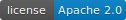
    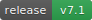
    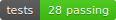
    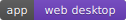
    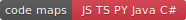
  </p>
  
</div>
  
MD-Editor is a local-first Markdown workspace for writing, previewing, organizing, and exporting technical documents.
It runs as a static web app and as a Neutralino-powered desktop app, with the same core editor experience in both places.
The project includes multi-tab editing, folder import, graph visualization, Markdown export workflows, and a code-to-Markdown converter that can turn source trees into navigable dependency maps.
  
---

## Table of Contents

- [What It Does](#what-it-does)
- [Screenshots](#screenshots)
  - [Split Editor And Live Preview](#split-editor-and-live-preview)
  - [Folder Workspace And Rich Markdown](#folder-workspace-and-rich-markdown)
  - [Graph View And File Actions](#graph-view-and-file-actions)
  - [Navigation Menu And Graph Selection](#navigation-menu-and-graph-selection)
  - [Settings](#settings)
  - [Convert Code To MD](#convert-code-to-md)
- [Key Features](#key-features)
- [Repository Layout](#repository-layout)
- [Run The Web App](#run-the-web-app)
- [Run The Desktop App](#run-the-desktop-app)
- [Convert Code To Markdown](#convert-code-to-markdown)
- [Development](#development)
- [Privacy Model](#privacy-model)
- [Project Origin](#project-origin)
- [License](#license)

---
  
## What It Does

- Write Markdown in a split editor with live GitHub-style preview.
- Render tables, code blocks, GitHub alerts, Mermaid diagrams, LaTeX math, emoji, and YAML frontmatter.
- Work across multiple tabs with session restore, rename, duplicate, close, and reset actions.
- Open individual text files or folders of Markdown documents.
- Explore folder relationships in Graph View, including Markdown links, tags, and generated dependency maps.
- Export documents as Markdown, HTML, or PDF.
- Share compressed documents through URLs.
- Convert source code folders into Markdown files with dependency links and optional member documentation.

## Screenshots

### Split Editor And Live Preview

Write Markdown on the left and review the rendered document on the right without leaving the workspace. The preview supports syntax-highlighted code blocks, LaTeX math, Mermaid diagrams, and task lists.

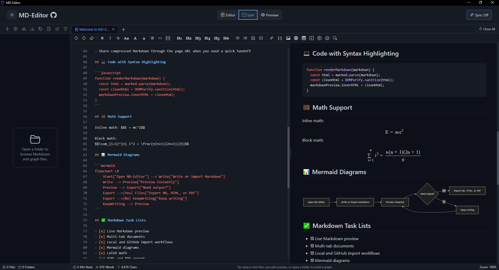

### Folder Workspace And Rich Markdown

Open a folder to browse local Markdown files, switch between multiple tabs, and keep documents organized in a tree. The same preview renderer handles tables, inline formatting, keyboard tags, GitHub-style alerts, and helpful links.

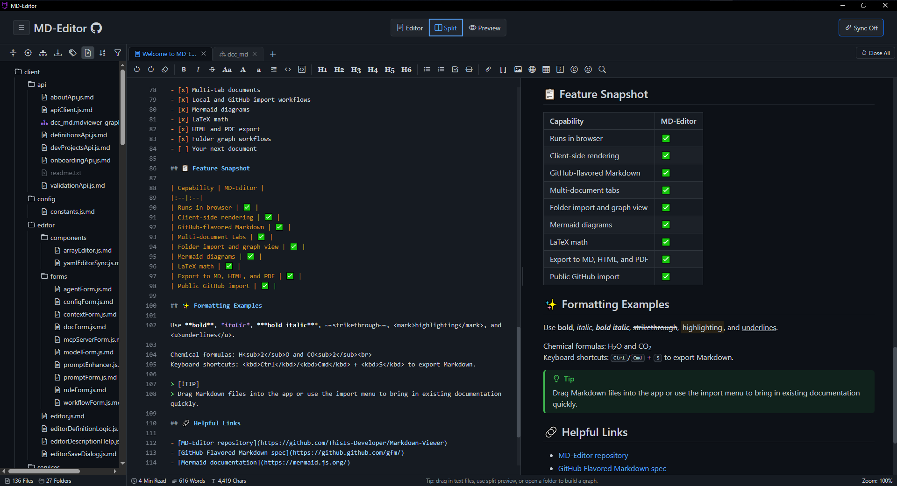

### Graph View And File Actions

Graph View turns linked Markdown folders and generated code maps into an interactive relationship map. It helps you explore code structure visually, see dependency relationships that are hard to spot in a file tree, and export connected parts of the codebase for deeper analysis, follow-up work, or refactoring.

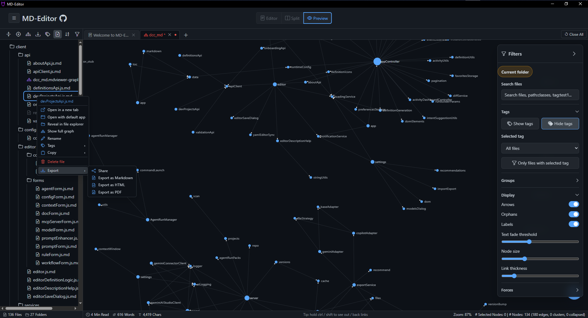

### Navigation Menu And Graph Selection

The main menu keeps workspace actions close at hand, including GitHub import, local file and folder open, recent items, graph saving, folder-to-graph export, and code conversion. Selected graph nodes are highlighted with connected relationships so larger dependency maps stay readable.

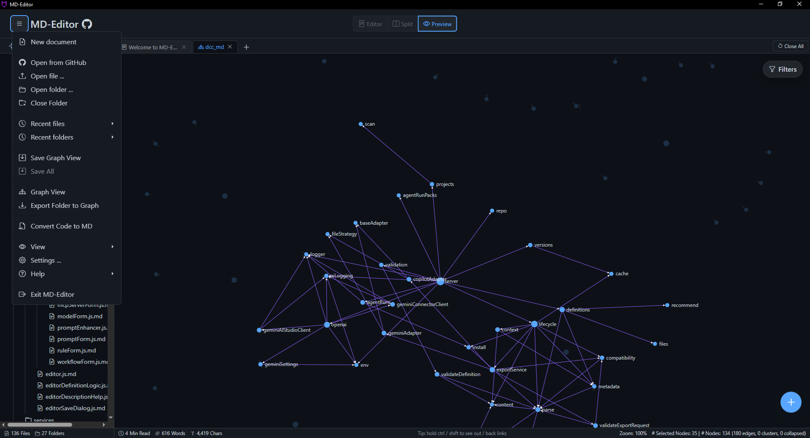

### Settings

Settings let you shape MD-Editor around the way you work. You can make graph exploration denser or calmer, adjust visual emphasis, control how much history the app remembers, and choose which high-impact actions should ask for confirmation.

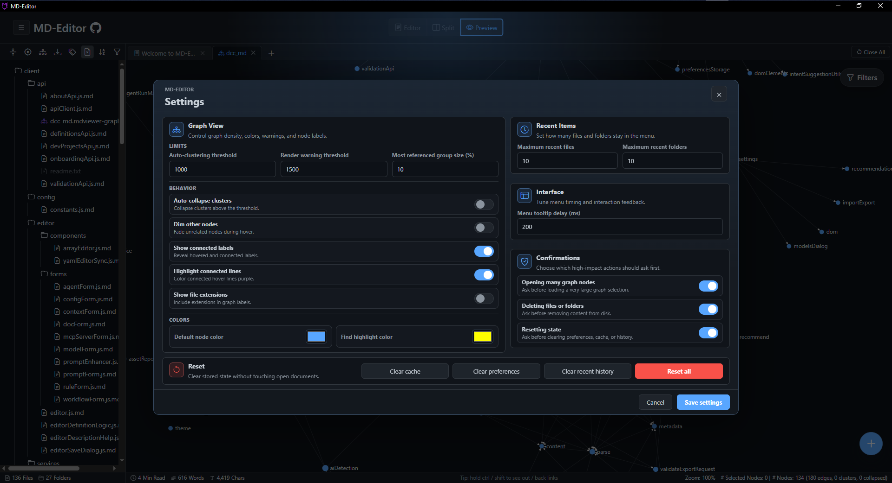

### Convert Code To MD

The converter generates one Markdown file per source file and records local dependencies, metadata, signatures, return values, exceptions, and package/module names when requested.
After conversion, generated Markdown files can be opened in the same folder tree and previewed like any other document. This lets source-code documentation become part of the same tabbed writing, reviewing, and graph exploration flow.

Supported converter languages: JavaScript, TypeScript, Python, Java, and C#.

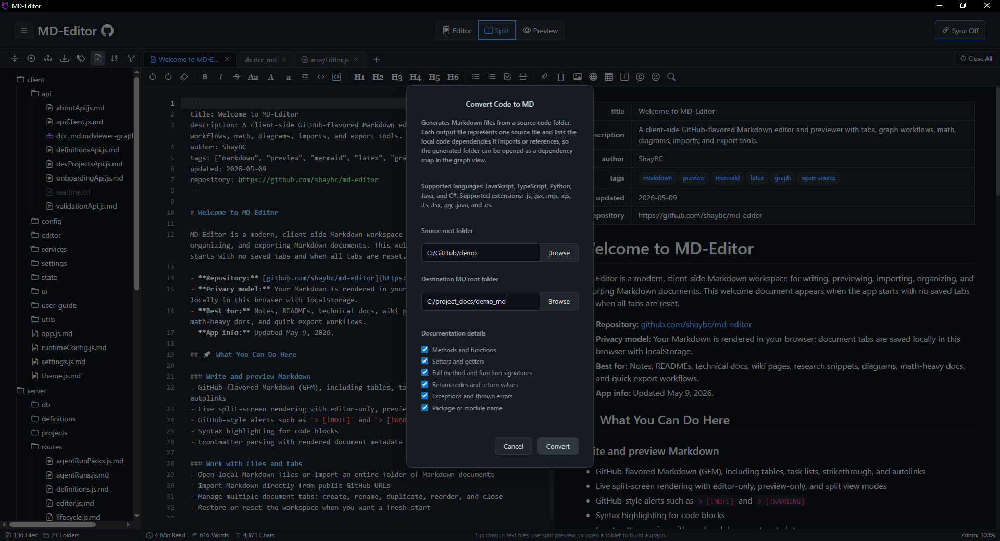


## Key Features

| Area | Highlights |
| --- | --- |
| Editing | Multi-tab Markdown editing, formatting toolbar, find/replace, syntax-aware editor overlay |
| Preview | GitHub-flavored Markdown, frontmatter table, Mermaid, MathJax, syntax highlighting, alerts |
| Files | Local file open, folder import, drag and drop, recent files and folders |
| Graphs | Folder graph view, tags, filters, node controls, saved graph documents |
| Export | Markdown, standalone HTML, PDF, folder-to-graph archive |
| Code maps | Dependency Markdown generation for JS/TS, Python, Java, and C# |
| Desktop | Neutralino app sharing the same web UI, with native file dialogs and app lifecycle hooks |

## Repository Layout

```text
.
├── code_converter/                 # Source-to-Markdown dependency generator
├── desktop-app/                    # Neutralino desktop app and packaged resources
├── web-app/                        # Static browser app
│   ├── assets/                     # App images and README screenshots
│   ├── js/                         # Extracted app modules
│   ├── tests/                      # Node and Playwright tests
│   ├── index.html
│   ├── script.js
│   └── styles.css
└── wiki/                           # Project documentation pages
```

## Run The Web App

Use any static file server from the repository root:

```bash
python -m http.server 9500 --directory web-app
```

Then open:

```text
http://localhost:9500/
```

Or use Docker Compose:

```bash
cd web-app
docker compose up --build
```

Then open:

```text
http://localhost:8080/
```

## Run The Desktop App

```bash
cd desktop-app
npm run dev
```

The desktop dev command prepares the shared resources and starts the Neutralino app. Platform binaries are downloaded and cached by the desktop setup script when needed.

## Convert Code To Markdown

The converter is available from the app UI and can also be run directly:

```bash
node code_converter/dependency-md-generator.js <source-root> <destination-root> --include-methods --include-signatures
```

Useful switches:

```text
--include-methods
--include-accessors
--include-signatures
--include-return-codes
--include-exceptions
--include-package
```

Open the generated destination folder in MD-Editor to inspect the files as Markdown or graph them as a dependency map.

## Development

Install dependencies for the web app:

```bash
cd web-app
npm install
```

Run the Node test suite:

```bash
npm test
```

Run JavaScript syntax checks:

```bash
npm run check:js
```

Run Playwright tests:

```bash
npm run test:e2e
```

## Privacy Model

MD-Editor is designed around local processing. Markdown rendering, tab state, graph state, and exports are handled in the browser or desktop app. The web build references public CDN libraries from `index.html`; for isolated or offline use, serve the vendored desktop resources or replace the CDN references with local assets.

## Project Origin

This project started as a fork of [ThisIs-Developer/MD-Editor](https://github.com/ThisIs-Developer/Markdown-Viewer).

## License

This project is licensed under the Apache License 2.0. See [LICENSE](LICENSE) for details.
