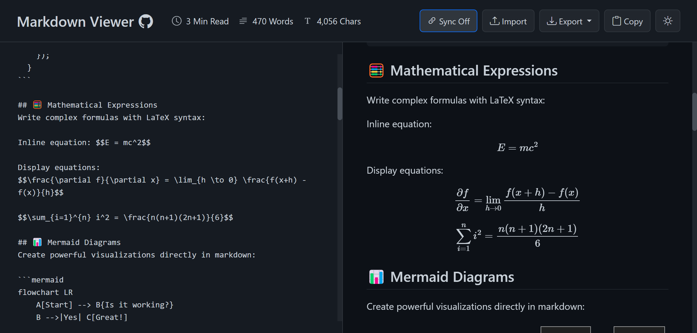
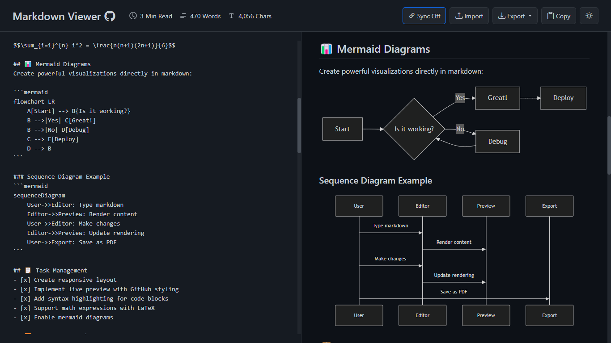

# MD-Editor (Forked by SBC)

<div align="center">
  

  <p><strong>Professional GitHub-style Markdown editor and previewer</strong></p>
  <p>Live preview, diagrams, math, export tools, and multi-document workflows — all in your browser.</p>

  <p>
    <a href="https://markdownviewer.pages.dev/">Live Demo</a> ·
    <a href="https://github.com/ThisIs-Developer/Markdown-Viewer/wiki">Documentation</a> ·
    <a href="https://github.com/ThisIs-Developer/Markdown-Viewer/issues">Issues</a> ·
    <a href="https://github.com/ThisIs-Developer/Markdown-Viewer/releases">Releases</a>
  </p>

  <p>
    
    
    
    
  </p>

  <p>
    <a href="https://deepwiki.com/ThisIs-Developer/Markdown-Viewer"></a>
  </p>
</div>

---

## Table of Contents

- [About the Project](#about-the-project)
- [Features](#features)
- [Screenshots](#screenshots)
- [Getting Started](#getting-started)
- [Usage](#usage)
- [Documentation](#documentation)
- [Built With](#built-with)
- [Showcase](#showcase)
- [Contributing](#contributing)
- [Contributors](#contributors)
- [Development Journey](#development-journey)
- [License](#license)
- [Contact](#contact)

---

## About the Project

MD-Editor is a full-featured Markdown editor and preview application that renders GitHub-flavored Markdown in real time. It is entirely client-side, lightweight, and optimized for a professional writing workflow — from quick notes to technical documentation with diagrams and LaTeX.

---

## Features

**Editor & Preview**
- Live split-screen rendering with instant updates
- GitHub-flavored Markdown (GFM) support
- Syntax highlighting for 190+ languages
- GitHub-style alerts/admonitions (`[!NOTE]`, `[!TIP]`, `[!WARNING]`, etc.)
- Emoji shortcode rendering (JoyPixels) and native Unicode emoji support
- YAML frontmatter parsing with a rendered metadata table

**Diagrams & Math**
- LaTeX math rendering via MathJax (inline + block)
- Mermaid diagrams with an interactive toolbar (zoom, pan, copy, PNG/SVG export)

**File & Sharing Tools**
- Import from local files, drag & drop, or public GitHub URLs (multi-file selection)
- Export as Markdown, HTML (standalone), or PDF
- Share documents via URL with compressed content
- Copy rendered HTML directly to clipboard

**Productivity & Workflow**
- Multiple document tabs (new, rename, duplicate, delete)
- Reset all tabs in one action
- Drag-and-drop tab reordering
- Tab/session state saved in localStorage
- View modes: editor-only, preview-only, or split
- Resizable editor/preview panes
- Synchronized scrolling (toggleable)
- Live content statistics (words, characters, reading time)
- Keyboard shortcuts (export, copy, new/close tab, sync toggle, indentation)

**UI & Accessibility**
- Responsive layout with a dedicated mobile menu
- Light/dark themes with system preference support

**Privacy & Security**
- 100% client-side processing
- Sanitized HTML rendering with DOMPurify
- No tracking, no cookies, no server storage

---

## Screenshots

### Code Syntax Highlighting


### Mathematical Expressions Support


### Mermaid Diagrams


### Tables Support


---

## Getting Started

### Option 1 — Docker (Recommended)
```bash
docker run -d \
  --name markdown-viewer \
  -p 8080:80 \
  --restart unless-stopped \
  ghcr.io/thisis-developer/markdown-viewer:latest
```
Open **http://localhost:8080**.

### Option 2 — Docker Compose
```bash
git clone https://github.com/ThisIs-Developer/Markdown-Viewer.git
cd Markdown-Viewer/web-app
docker compose up -d
```

### Option 3 — Static Web Server
```bash
git clone https://github.com/ThisIs-Developer/Markdown-Viewer.git
cd Markdown-Viewer/web-app
python3 -m http.server 8080
```

### Option 4 — Desktop App
Download pre-built binaries from the [Releases](https://github.com/ThisIs-Developer/Markdown-Viewer/releases) page or build from source (see the [Desktop App](https://github.com/ThisIs-Developer/Markdown-Viewer/wiki/Desktop-App) guide).

---

## Usage

1. Write Markdown in the left editor pane.
2. Preview the rendered output on the right.
3. Import, export, share, or switch view modes using the toolbar.
4. Use the tab bar to manage multiple documents.

**Keyboard Shortcuts**
- `Ctrl/Cmd + S` → Export Markdown
- `Ctrl/Cmd + C` → Copy rendered HTML (when no text is selected)
- `Ctrl/Cmd + Shift + S` → Toggle sync scrolling (split view)
- `Ctrl/Cmd + T` → New tab
- `Ctrl/Cmd + W` → Close tab
- `Tab` → Insert indentation in editor

---

## Documentation

Explore the full documentation on the wiki:

- [Features](https://github.com/ThisIs-Developer/Markdown-Viewer/wiki/Features)
- [Usage Guide](https://github.com/ThisIs-Developer/Markdown-Viewer/wiki/Usage-Guide)
- [Installation](https://github.com/ThisIs-Developer/Markdown-Viewer/wiki/Installation)
- [Markdown Reference](https://github.com/ThisIs-Developer/Markdown-Viewer/wiki/Markdown-Reference)
- [FAQ](https://github.com/ThisIs-Developer/Markdown-Viewer/wiki/FAQ)
- [Configuration](https://github.com/ThisIs-Developer/Markdown-Viewer/wiki/Configuration)

---

## Built With

- HTML5, CSS3, JavaScript
- [Bootstrap](https://getbootstrap.com/)
- [Marked.js](https://marked.js.org/)
- [highlight.js](https://highlightjs.org/)
- [MathJax](https://www.mathjax.org/)
- [Mermaid](https://mermaid.js.org/)
- [DOMPurify](https://github.com/cure53/DOMPurify)
- [FileSaver.js](https://github.com/eligrey/FileSaver.js)
- [html2canvas](https://github.com/niklasvh/html2canvas) + [jsPDF](https://www.npmjs.com/package/jspdf)
- [JoyPixels](https://www.joypixels.com/)

---

## Showcase

**Built with MD-Editor**

| Project | Description |
|---------|-------------|
| [Markdown Desk](https://github.com/jhrepo/markdown-desk) | Native macOS wrapper built with [Tauri](https://tauri.app/), adding live reload and native file open/save. |

---

## Contributing

Contributions are welcome! Please review the [Contributing Guide](https://github.com/ThisIs-Developer/Markdown-Viewer/wiki/Contributing) and open a pull request.

---

## Contributors

Thanks to everyone who has contributed to MD-Editor.

[](https://github.com/ThisIs-Developer/Markdown-Viewer/graphs/contributors)

---

## 📈 Development Journey

MD-Editor has grown from a lightweight Markdown parser into a full-featured, professional application with advanced rendering, workflow, and export capabilities. Compare the [current version](https://markdownviewer.pages.dev/) with the [original version](https://a1b91221.markdownviewer.pages.dev/) to see the progress in UI design, performance optimization, and feature depth.

---

## License

This project is licensed under the Apache License. See [LICENSE](LICENSE) for details.

---

## Contact

Developed and maintained by [ThisIs-Developer](https://github.com/ThisIs-Developer).
