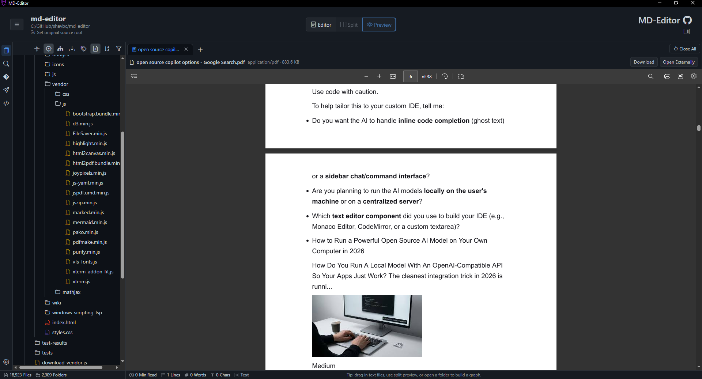
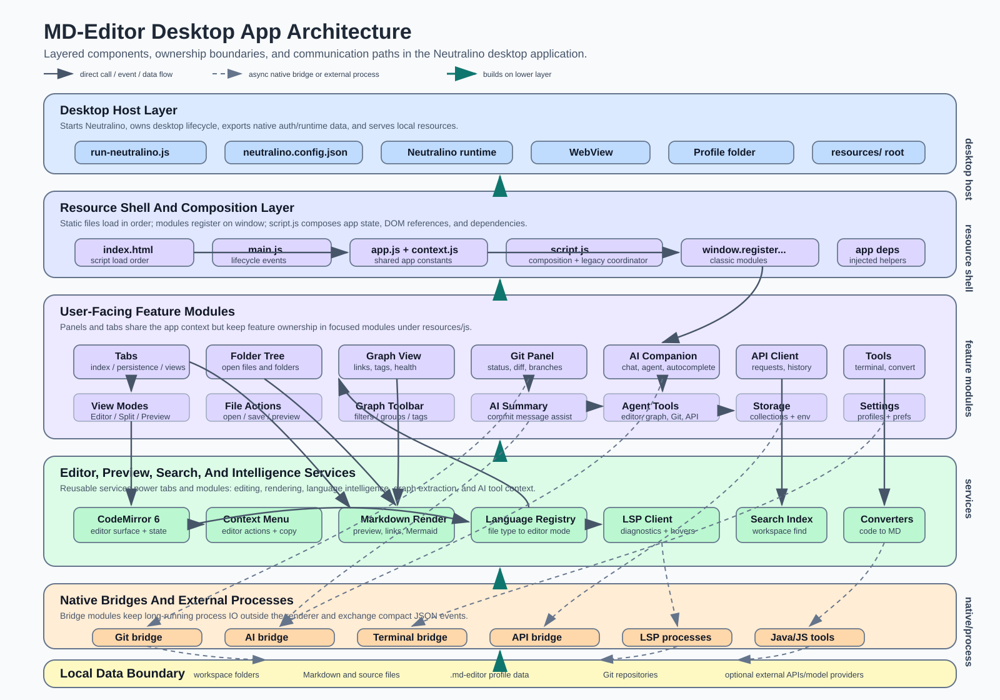
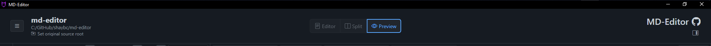

# 1. Architecture

MD-Editor is a Neutralino desktop application that renders a single-page JavaScript UI inside a local WebView. The architecture is intentionally simple at runtime: HTML loads classic scripts in order, each module registers itself on `window`, and `resources/js/script.js` composes the modules into one app context.



## Component Architecture Diagram



Read the diagram from bottom to top to see what each layer builds on, and follow the arrows to see where modules communicate directly or through asynchronous desktop bridges. The central path is `run-neutralino.js` -> `resources/index.html` -> `resources/js/script.js` -> registered feature modules. Cross-links show important runtime relationships such as tabs using CodeMirror, CodeMirror reaching language-server support, Git requesting AI summary help, and desktop modules using native bridges for long-running process work.

## 1.1. Runtime Layers

| Layer | Path | Responsibility | Why It Exists |
| --- | --- | --- | --- |
| Desktop launcher | `desktop-app/run-neutralino.js` | Starts Neutralino, exports auth info, serves loader diagnostics, validates resources, manages shutdown cleanup. | Keeps OS/runtime startup outside the renderer. |
| Neutralino config | `desktop-app/neutralino.config.json` | Defines `/resources/` document root, native API allow list, window settings, binary versions. | Controls what native capabilities the WebView can use. |
| Desktop lifecycle | `desktop-app/resources/js/main.js` | Calls `Neutralino.init()`, handles ready/window/tray events, restores window state. | Owns app lifecycle that must happen before or around UI startup. |
| UI shell | `desktop-app/resources/index.html` | Declares menus, panes, dialogs, toolbar buttons, modals, and script load order. | Keeps the app static and predictable. |
| Composition layer | `desktop-app/resources/js/script.js` | Wires DOM references, shared state, actions, and registered modules. | Acts as the legacy coordinator while features move into modules. |
| Feature modules | `desktop-app/resources/js/**` | Own tabs, files, graph, markdown, search, settings, AI, Git, terminal, API Client. | Makes features discoverable and testable. |
| Node bridges | `desktop-app/resources/bridges/**` and bridge folders | Run desktop-only subprocess work and return structured results. | Keeps heavy/native work outside the renderer thread. |

## 1.2. Bootstrap Flow



1. `npm run prod` runs `node run-neutralino.js run`.
2. `run-neutralino.js` checks that `resources/index.html` exists and launches the cached Neutralino binary.
3. Neutralino serves `resources/index.html` from the configured document root.
4. `resources/js/main.js` calls `Neutralino.init()` and handles native lifecycle events.
5. `resources/js/app.js` and `resources/js/core/context.js` create the shared `markdownViewerApp` object and constants.
6. Feature modules register `window.registerMarkdownViewer...` functions.
7. `resources/js/script.js` calls the registration functions, binds DOM events, hydrates profile state, restores tabs, and opens startup files/folders.

Primary functions to inspect:

| Function | File | Role |
| --- | --- | --- |
| `runNeutralinoRuntime()` | `run-neutralino.js` | Starts the desktop runtime binary with the configured resource path. |
| `createDesktopAuthPayload()` | `run-neutralino.js` | Builds auth/runtime values passed to the renderer. |
| `Neutralino.init()` | `resources/js/main.js` | Connects the WebView to Neutralino native APIs. |
| `startMarkdownViewer()` | `resources/js/script.js` | Main app startup sequence and module wiring. |
| `hydrateTabsSessionFromProfile()` | `resources/js/script.js` | Reads desktop tab session data before tab initialization. |
| `restoreLastFolderOnStartupIfNeeded()` | `resources/js/script.js` | Restores the last folder when settings and permissions allow it. |

## 1.2.1. Runtime Dependencies And `node_modules`

The desktop app can launch without a local `node_modules` folder because the normal startup path uses checked-in runtime assets. `npm run prod` runs `node run-neutralino.js run`, and that command launches the cached Neutralino binary from `desktop-app/bin` with `desktop-app/resources` as the document root. The renderer then loads static JavaScript and CSS files from `resources/index.html`, including vendored browser libraries under `resources/vendor` and the checked-in CodeMirror bundle.

That means basic editing, preview, tabs, graph rendering, exports, settings, and other renderer-only workflows do not need npm packages to be installed locally. `node_modules` becomes necessary when a feature starts a Node-backed helper, a language server, a desktop bridge, test tooling, or a build command that depends on packages from `desktop-app/package.json`.

| Package | Feature Area | Why It Is Needed |
| --- | --- | --- |
| `fast-glob` | AI Companion workspace tools | Provides fast glob matching for agent file discovery. The AI Companion bridge loads workspace tools when those modes need repository context. |
| `simple-git` | Git panel and AI Git tools | Backs the desktop Git bridge for status, branch, commit, push/pull, stash, compare, and change-digest operations. |
| `node-pty` | Desktop terminal | Runs shell sessions behind the embedded terminal with PTY behavior. |
| `typescript` and `typescript-language-server` | JavaScript and TypeScript IntelliSense | Provide the TypeScript compiler and language-server process used by desktop LSP support. |
| `pyright` | Python IntelliSense | Provides the Python language-server process. |
| `vscode-langservers-extracted` | HTML, CSS, and JSON IntelliSense | Provides the VS Code HTML, CSS, and JSON language-server binaries. |
| `yaml-language-server` | YAML IntelliSense | Provides the YAML language-server process. |
| `bash-language-server` | Bash IntelliSense | Provides the Bash language-server process. |
| `dockerfile-language-server-nodejs` | Dockerfile IntelliSense | Provides the Dockerfile language-server process. |
| `vscode-languageserver` and `vscode-languageserver-textdocument` | Windows scripting IntelliSense | Provide the protocol and text-document primitives used by the local Windows scripting LSP server. |
| `@playwright/test` | Developer tests | Runs browser and desktop workflow tests; it is a development dependency, not a normal runtime dependency. |

Build and setup commands have a separate dependency shape. `npm run setup` can download Neutralino binaries and vendor assets when they are missing, and build commands expect the Neutralino CLI to be available locally or through setup. The production run path is intentionally lighter: if the cached binary and resources are present, the app can start before `npm install` has created `node_modules`.

## 1.3. Module Registration Pattern

Most runtime modules follow this shape:

```js
(function(window) {
  window.registerMarkdownViewerFeatureName = function registerMarkdownViewerFeatureName(app, deps) {
    // create API, bind helpers, return methods
  };
})(window);
```

The composition layer passes `app` and `deps` so modules can use shared services without importing ES modules. This matters because the runtime does not bundle JavaScript.

When adding a feature:

- Add the module under the closest `resources/js/<area>/` folder.
- Load it in `resources/index.html` before `resources/js/script.js`.
- Register it from `script.js` or from an existing module owner.
- Add Node tests for pure helpers and Playwright tests for user workflows.

## 1.4. Desktop API Boundary

Neutralino APIs must be guarded because tests, helper contexts, and some app surfaces may run without every native capability.

For the full renderer, Neutralino runtime, and Node bridge communication model, see [8. Runtime Bridge Model](08-runtime-bridge-model.md).

Common guard pattern:

```js
if (typeof Neutralino !== "undefined" && Neutralino.filesystem?.readFile) {
  return Neutralino.filesystem.readFile(path);
}
```

Important native APIs:

| API | Used For |
| --- | --- |
| `Neutralino.filesystem.readFile()` | Markdown/text reads, graph documents, profile data, API Client storage. |
| `Neutralino.filesystem.writeFile()` | Saves, drafts, graph documents, API Client storage, settings export. |
| `Neutralino.filesystem.readDirectory()` | Folder tree, workspace search, profile directory reads. |
| `Neutralino.os.showOpenDialog()` | File picker and import workflows. |
| `Neutralino.os.showFolderDialog()` | Folder picker and converter path selection. |
| `Neutralino.os.showSaveDialog()` | Save As, exports, graph documents, settings export. |
| `Neutralino.os.spawnProcess()` | Bridges, terminal sessions, API requests, AI Companion, LSP. |
| `Neutralino.os.execCommand()` | Short native commands and legacy integrations. |

Previous: [Developer Guide](index.md)  
Next: [2. Runtime And Resources](02-runtime-and-resources.md)

