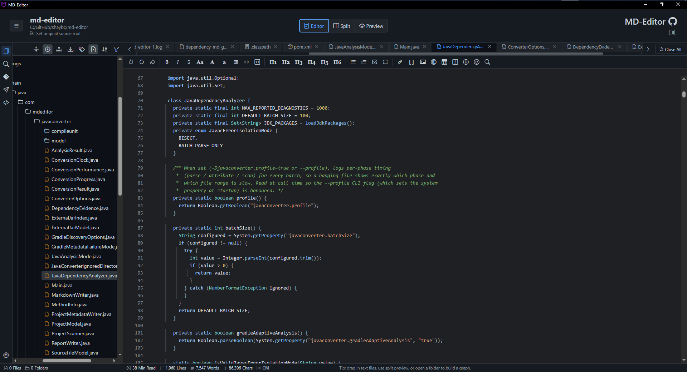
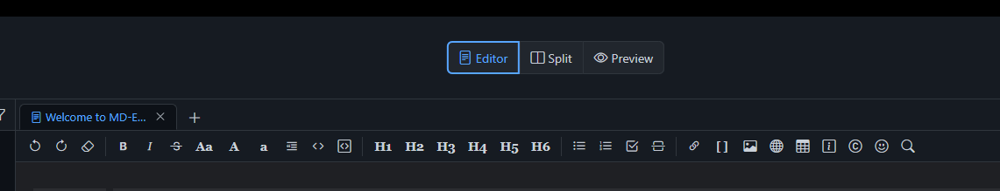
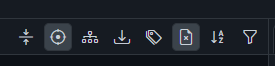

# 3. Modules

Runtime behavior is split across classic-script modules under `desktop-app/resources/js`. This chapter points to the main owners and the functions an implementer should inspect first.

## 3.1. Tabs

Tabs are owned by three cooperating modules.

| File | Main Functions | Responsibility |
| --- | --- | --- |
| `resources/js/tabs/index.js` | `newTab()`, `switchTab()`, `renderTabBar()`, `createGraphTab()`, `saveCurrentFileIfChanged()` | Tab creation, activation, rendering, tab context menu, graph tab creation, dirty state coordination. |
| `resources/js/tabs/view-manager.js` | `ensureTabView()`, `activateTabView()`, `destroyTabView()` | Creates and switches per-tab DOM roots so graph/API/compare/editor tabs do not fight over one surface. |
| `resources/js/tabs/persistence.js` | `serializeTab()`, `createProfilePayload()`, `restoreTabsFromPayload()`, `restoreMarkdownTab()`, `restoreGraphTab()` | Converts tabs to desktop profile payloads and restores them on startup. |
| `resources/js/tabs/profile-write-gate.js` | `schedule()`, `flushNow()`, `pause()`, `withPaused()` | Debounces and pauses profile writes during sensitive operations. |

Implementation notes:

- `newTab(content, title, options)` is the normal entry point for opening Markdown/help/report tabs.
- `switchTab(tabId)` activates an existing tab and updates editor/preview/graph surfaces.
- Tab descriptors should stay small; dirty drafts are written separately by persistence helpers.
- Specialized tabs should mount through `view-manager.js` instead of reusing the legacy editor DOM directly.

## 3.2. Files

File behavior is split by concern.

| File | Main Functions | Responsibility |
| --- | --- | --- |
| `resources/js/files/open.js` | `openDocumentSourceFile()`, `openMarkdownSourceFile()`, `openFolderTreeFromNeutralinoPath()`, `openDocumentFileFromPicker()` | Opens files/folders from dialogs, tree clicks, recent entries, and desktop paths. |
| `resources/js/files/save.js` | `saveActiveTabToSource()`, `saveActiveFileTabAs()`, `saveMarkdownTabToSource()`, `saveActiveTabWithSaveDialog()` | Saves source-backed tabs and Save As targets. |
| `resources/js/files/types.js` | `isMarkdownPath()`, `isTextDocumentPath()`, `isSupportedFolderTreeDocumentPath()`, `looksLikeGraphDocument()` | File classification and title/path helpers. |
| `resources/js/files/preview.js` | `mountFilePreviewTab()`, `createPreviewBlobUrl()` | Non-editor previews for embeddable/binary-ish files. |
| `resources/js/files/large-file-viewer.js` | `shouldUseLargeFileViewer()`, `mountLargeFileTab()`, `runSearch()` | Safe viewer for very large text-like files. |
| `resources/js/files/large-json.js` | `shouldOpenJsonInSafeView()`, `prepareLargeJsonForOpen()` | Protects the editor from JSON files that are too large or dense. |
| `resources/js/files/compare.js` | `openCompareFilesFromPicker()`, `mountFileCompareTab()`, `parseGitConflictDocument()` | Side-by-side compare and conflict-resolution surfaces. |

Implementation notes:

- `openDocumentSourceFile()` is the safest general file-open entry point.
- `openMarkdownSourceFile()` is specifically for Markdown/text tabs.
- Use save helpers so dirty state, source metadata, watcher suppression, and folder refresh stay consistent.

## 3.3. Markdown

| File | Main Functions | Responsibility |
| --- | --- | --- |
| `resources/js/markdown/render.js` | `renderMarkdownContent()`, `renderMarkdown()` | Marked/DOMPurify render pipeline, Mermaid/MathJax/frontmatter post-processing. |
| `resources/js/markdown/links.js` | `openBundledWikiLinkFromPreview()`, `resolveMarkdownLinkPath()`, `enhanceWikiLinks()` | Link normalization, Help/wiki links, local file links, external links, heading anchors. |
| `resources/js/markdown/frontmatter.js` | frontmatter parse/render helpers | YAML metadata display and graph/tag source. |
| `resources/js/markdown/mermaid-tools.js` | Mermaid toolbar/export helpers | Diagram zoom, copy, SVG/PNG export. |
| `resources/js/markdown/renderer-config.js` | renderer preference helpers | Markdown renderer settings and feature toggles. |

Implementation notes:

- Do not bypass `renderMarkdownContent()` for user-authored Markdown. It applies sanitization and post-render enhancements. For user syntax behavior, see [Markdown Reference](../user/markdown-reference.md).
- Help links depend on `linkBasePath` being set on the Help tab.
- Graph extraction reads Markdown links separately in `resources/js/graph/extraction.js`; changing link syntax may need changes in both areas.
- For preview cache, Mermaid/MathJax, frontmatter, and HTML iframe details, see [14. Markdown Preview And HTML Internals](14-markdown-preview-and-html.md).

## 3.4. Sidebar And Folder Toolbar

| File | Main Functions | Responsibility |
| --- | --- | --- |
| `resources/js/sidebar/folder-toolbar.js` | `renderFilteredFolderTree()`, `setAllFolderTreeDetails()`, `syncFolderTreeSelectionToActiveTab()`, `setShowUnsupportedFolderFiles()` | Filter, sort, expand/collapse, unsupported-file toggle, auto-select, tag filtering. |
| `resources/js/sidebar/context-tree.js` | context tree registration and rendering helpers | Tree DOM rendering and context-tree behavior. |
| `resources/js/platform/folder-picker.js` | folder picker registration | Browser/desktop folder-selection abstraction. |
| `resources/js/platform/folder-watcher.js` | watcher helpers | Neutralino file watcher setup and suppression. |

Implementation notes:

- Large-folder performance changes usually start in `openFolderTreeFromNeutralinoPath()`, `listMarkdownTreeNeutralino()`, and folder-toolbar rendering.
- Auto-select behavior starts in `syncFolderTreeSelectionToActiveTab()`.
- Unsupported-file visibility should use `setShowUnsupportedFolderFiles()` so toolbar state and rendering stay aligned.
- For toolbar state and context-menu action details, see [15. Folder Tree And Context Menus](15-folder-tree-context-menus.md).

## 3.5. Search

| File | Main Functions | Responsibility |
| --- | --- | --- |
| `resources/js/search/workspace-search.js` | `openWorkspaceSearchModal()` | Workspace search dialog and result rendering. |
| `resources/js/search/open-file-by-name.js` | `openFileByNameModal()` | Fast filename search across visible/lazy workspace entries. |
| `resources/js/search/find-in-files.js` | find-in-files dialog and results panel helpers | Cross-file content search with masks and options. |

Implementation notes:

- Search must avoid blocking the renderer on huge folders. For the detailed user workflow and module map, see [Search Workflow Details](../user/search-workflows.md).
- Open-by-name should prefer existing tree metadata and lazy providers rather than requiring full expansion.

## 3.6. Settings And UI

| File | Main Functions | Responsibility |
| --- | --- | --- |
| `resources/js/ui/settings-screen.js` | settings tab/render helpers | Settings dialog UI and preference binding. |
| `resources/js/ui/settings-transfer.js` | export/import helpers | Portable settings import/export. |
| `resources/js/ui/theme-registry.js` | theme registry helpers | Built-in/custom theme normalization and CSS variable application. |
| `resources/js/ui/view-window-controls.js` | full screen, zoom, downloads | Window and view commands from the Actions menu. |

Implementation notes:

- Settings should flow through existing preference helpers so profile writes and UI refresh stay consistent. For the preference map, see [12. Settings Preference Map](12-settings-preference-map.md).
- Desktop file import/export settings must use guarded Neutralino dialogs and filesystem calls.

Previous: [2. Runtime And Resources](02-runtime-and-resources.md)  
Next: [4. Desktop Bridges](04-desktop-bridges.md)
