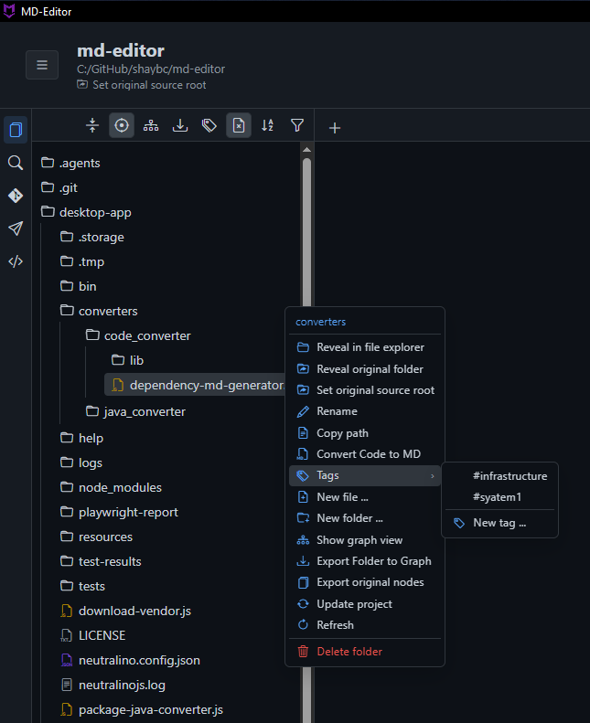
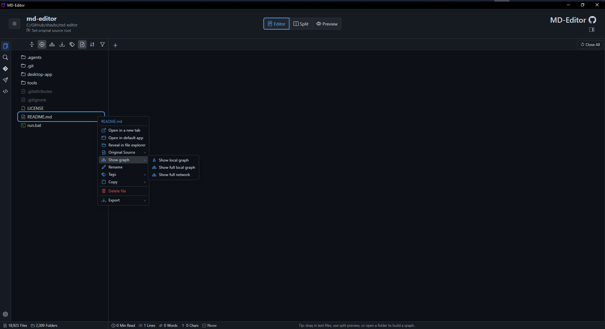
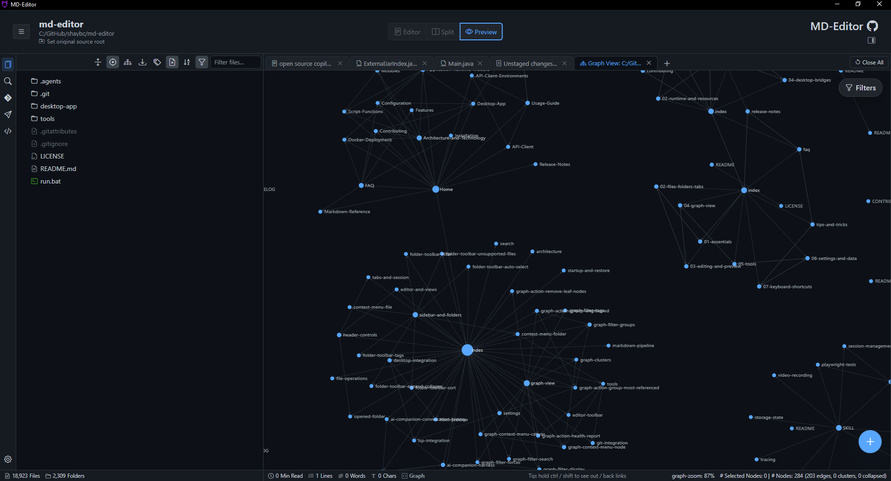
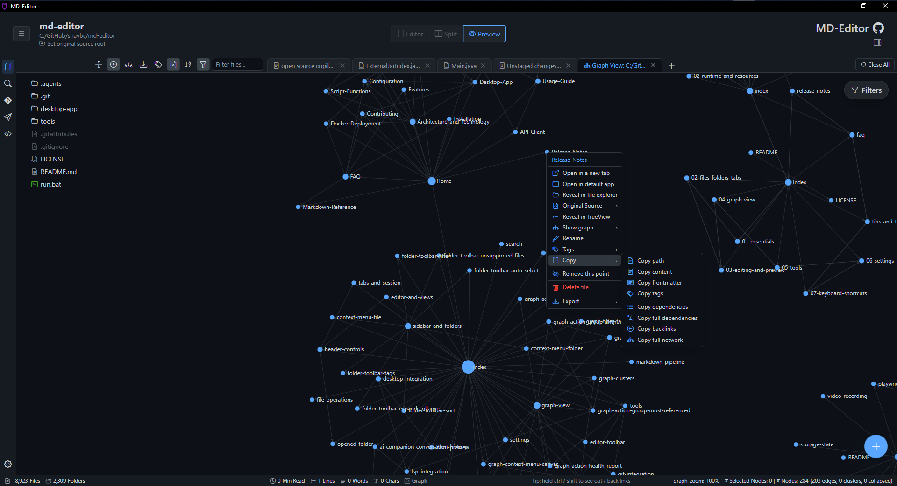
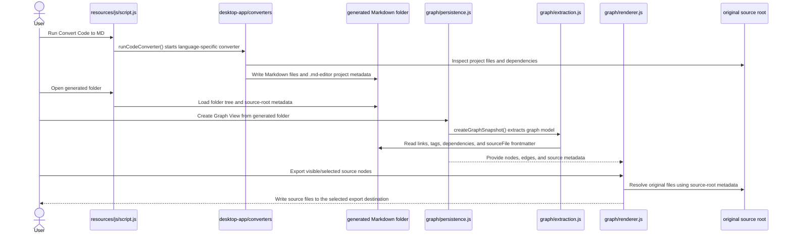

# 5. Files, Folders, And Graph

This chapter connects the major workspace workflows to their implementation entry points.

## 5.1. Folder Open Flow

User action: <kbd>Actions</kbd> -> <kbd>Open folder...</kbd>, recent folder, or startup restore.

Implementation flow:

1. Folder selection starts in picker/menu logic and reaches `openFolderTreeFromNeutralinoPath(selectedPath, options)` in `resources/js/files/open.js`.
2. Desktop directory reading uses `listMarkdownTreeNeutralino(dirPath, options)` in `resources/js/script.js`.
3. The returned tree is stored in shared folder state and rendered by sidebar/context-tree helpers.
4. Folder toolbar state updates through `updateFolderTreeToolbarState()` and related functions in `resources/js/sidebar/folder-toolbar.js`.
5. Recent folder/profile state updates through recent/profile helpers.
6. Optional graph and file watcher startup happens after the folder identity is known.

Key functions:

| Function | File | Purpose |
| --- | --- | --- |
| `openFolderTreeFromNeutralinoPath(selectedPath, options)` | `resources/js/files/open.js` | Main desktop folder-open entry point. |
| `listMarkdownTreeNeutralino(dirPath, options)` | `resources/js/script.js` | Reads Neutralino directory entries and builds tree nodes. |
| `getNeutralinoDirectoryEntryRelativePath(rootPath, item)` | `resources/js/script.js` | Normalizes entry paths from Neutralino. |
| `renderFilteredFolderTree()` | `resources/js/sidebar/folder-toolbar.js` | Re-renders tree after filter/tag/sort/toggle changes. |
| `syncFolderTreeSelectionToActiveTab()` | `resources/js/sidebar/folder-toolbar.js` | Keeps active tab highlighted in the tree. |

Performance note: large-folder changes should avoid recursive renderer work that blocks file clicks. Prefer lazy providers, incremental rendering, and command/process work outside the renderer. For project metadata details, see [10. Project Metadata And Recovery](10-project-metadata-and-recovery.md).

For the folder toolbar, file/folder context menus, tag actions, and watcher behavior, see [15. Folder Tree And Context Menus](15-folder-tree-context-menus.md).

## 5.2. File Open Flow

User action: click a file in the folder tree, use Open file, recent file, graph node action, search result, or startup file handoff.

Implementation flow:

1. The app classifies the source with helpers in `resources/js/files/types.js`.
2. `openDocumentSourceFile(sourceFile, options)` in `resources/js/files/open.js` chooses the right open path.
3. Markdown/text files use `openMarkdownSourceFile(sourceFile, options)`.
4. Large files may use `openLargeFileSourceFile()` or large JSON helpers.
5. Previewable files may use `createFilePreviewSource()` and `mountFilePreviewTab()`.
6. `newTab()` in `resources/js/tabs/index.js` creates the tab.
7. `switchTab()` activates the tab and view manager mounts the right surface.

Key functions:

| Function | File | Purpose |
| --- | --- | --- |
| `isSidebarDocumentPath(path)` | `resources/js/files/types.js` | Decides whether a tree node is a document the app should show/open. |
| `openDocumentSourceFile(sourceFile, options)` | `resources/js/files/open.js` | General file-open router. |
| `openMarkdownSourceFile(sourceFile, options)` | `resources/js/files/open.js` | Markdown/text open path. |
| `shouldUseLargeFileViewer(sourceFile, name, content)` | `resources/js/files/large-file-viewer.js` | Protects UI from huge files. |
| `newTab(content, title, options)` | `resources/js/tabs/index.js` | Creates the visible tab. |

## 5.3. Save Flow

User action: <kbd>Ctrl</kbd> + <kbd>S</kbd>, Save Changes, Save As, Save All, graph save, settings export, API Client export.

Core file-save functions live in `resources/js/files/save.js`:

- `saveActiveTabToSource()` writes the active source-backed tab.
- `saveActiveFileTabAs()` opens a Save As flow for supported tabs.
- `saveMarkdownTabToSource(tab)` writes Markdown content to the tab source path.
- `saveActiveTabWithSaveDialog()` writes through a save dialog.
- `updateFolderTreeAfterDocumentSave(metadata)` refreshes folder tree state after new saves.

Use these helpers instead of writing files directly from feature code when saving user documents. They maintain tab metadata, dirty state, source paths, folder refresh, and desktop compatibility.

## 5.4. Graph Extraction Flow

Graph View starts with a snapshot, not the renderer.

1. A graph workflow gathers Markdown files from the folder or selected scope.
2. `createGraphSnapshot(files, folderName, options)` in `resources/js/graph/persistence.js` creates a serializable model.
3. `resources/js/graph/extraction.js` extracts links, wiki links, tags, source files, and unresolved dependencies.
4. `createGraphTab(folderName, options)` in `resources/js/tabs/index.js` creates the tab.
5. `renderGraphView(options)` in `resources/js/graph/renderer.js` renders the D3 graph.
6. `resources/js/graph/toolbar.js` controls filters, display settings, groups, tags, and actions.
7. `resources/js/graph/health.js` renders health reports.

Important extraction functions:

| Function | Purpose |
| --- | --- |
| `extractMarkdownLinks(markdown)` | Finds Markdown and wiki relationships. |
| `extractMarkdownTags(markdown)` | Finds inline tags. |
| `extractYamlFrontmatterTags(frontmatterText)` | Reads YAML frontmatter tags. |
| `extractSourceFileFromFrontmatter(markdown)` | Links generated Markdown back to original source. |
| `extractUnresolvedDependencies(markdown)` | Reads generated unresolved dependency metadata. |
| `createGraphTargetLookup(nodeIndex)` | Resolves graph targets from filenames and paths. |

## 5.5. Source-Root And Generated Docs

Generated Markdown often contains metadata pointing back to original source files. Source-root mapping lets user actions resolve from generated docs to the source project.

Developer landmarks:

- Source-root helpers and project metadata are used by graph node actions, folder context actions, and generated-doc workflows.
- `resources/js/graph/health.js` reports missing source roots and recovery opportunities.
- Converter output paths are controlled by `runCodeConverter()` and converter path helpers in `resources/js/script.js`.
- Java conversion uses `getJavaConverterRootCandidates()` and `getJavaConverterJarPath()`.

When changing generated-doc behavior, check both the converter output and graph extraction. A frontmatter field that is useful in Markdown may also need graph extraction and health-report support. For the user control reference, see [Detailed Graph View Controls](../user/graph-view-controls.md); for recovery internals, see [10. Project Metadata And Recovery](10-project-metadata-and-recovery.md).

For graph filter state, groups, forces, quick actions, clusters, and health-report internals, see [16. Graph Controls Internals](16-graph-controls-internals.md).

Previous: [4. Desktop Bridges](04-desktop-bridges.md)  
Next: [6. Testing](06-testing.md)

