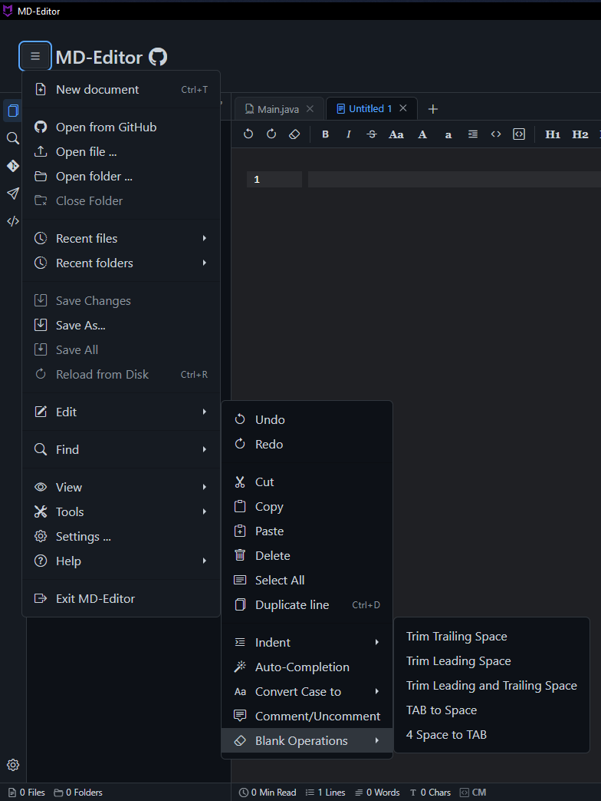
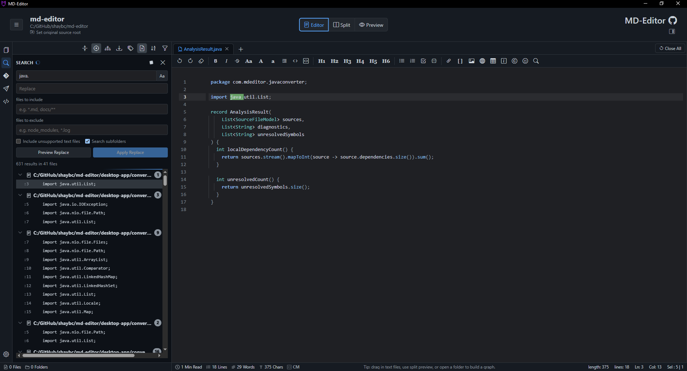
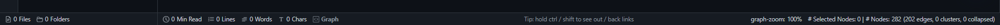

# 1. Essentials

MD-Editor is a desktop workspace for local Markdown and code-documentation work. It is intentionally local-first: the documents stay on your machine, the runtime UI is loaded from the desktop app resources, and native file operations go through the Neutralino desktop layer.

## 1.1. The Workspace

The main window is divided into predictable work areas.

The architecture overview is useful when you want to understand how the visible workspace is built: the desktop host loads the resource shell, the shell composes feature modules, and those modules talk to editor services, native bridges, and local data. As a user, this explains why features such as tabs, preview, graphing, Git, terminal, API Client, and AI Companion can share the same folder context without requiring a server account.

| Area | What It Does |
| --- | --- |
| Header | Contains the action menu, current folder title/path, view mode buttons, and app-level controls. |
| Sidebar rail | Switches between folder view, search, Git, tools, and other side panels. |
| Folder tree | Shows the open folder and its files. Large folders can load nested content lazily. |
| Tab bar | Shows open Markdown files, graph documents, API requests, previews, reports, and temporary pages. |
| Editor and preview surface | The main reading/writing area. It changes depending on the active tab type and selected view mode. |
| AI Companion panel | Optional side panel for chat, agent work, autocomplete settings, and activity history. |
| Status bar | Shows folder counts, cursor/document stats, graph stats, file type, tips, and progress details. |

To show or hide major UI areas, open <kbd>Actions</kbd> -> <kbd>View</kbd>. The same menu includes sidebar, dropzone, status bar, auto-select, unsupported-file visibility, zoom, downloads, and full-screen controls.

> Note: The app is a desktop app even though the UI is rendered in a WebView. Features such as native dialogs, local filesystem reads/writes, terminal sessions, Git, and language servers require the Neutralino desktop runtime.

## 1.2. Opening The Action Menu

The action menu is the main command entry point. Use it when you are unsure where a feature lives.

The menu groups commands by the kind of work you are doing: file and folder actions first, then editing, finding, view controls, tools, settings, help, and app exit. This keeps rare commands discoverable without crowding the main toolbar.

Common paths:

- <kbd>Actions</kbd> -> <kbd>Open file...</kbd> opens one local file.
- <kbd>Actions</kbd> -> <kbd>Open folder...</kbd> opens a local workspace folder.
- <kbd>Actions</kbd> -> <kbd>Recent files</kbd> returns to a previously opened file.
- <kbd>Actions</kbd> -> <kbd>Recent folders</kbd> returns to a previous workspace.
- <kbd>Actions</kbd> -> <kbd>Find</kbd> exposes file, workspace, and cross-file search tools.
- <kbd>Actions</kbd> -> <kbd>View</kbd> controls panes, zoom, full screen, and visibility toggles.
- <kbd>Actions</kbd> -> <kbd>Tools</kbd> opens conversion, terminal, compare, sorting, and API tools.
- <kbd>Actions</kbd> -> <kbd>Help</kbd> opens this guide, the README, welcome page, and license/about surfaces.

Keyboard entry points:

| Action | Shortcut |
| --- | --- |
| New document | <kbd>Ctrl</kbd> + <kbd>T</kbd> |
| Save active file | <kbd>Ctrl</kbd> + <kbd>S</kbd> |
| Reload active file | <kbd>Ctrl</kbd> + <kbd>R</kbd> |
| Toggle full screen | <kbd>F11</kbd> |
| Downloads | <kbd>Ctrl</kbd> + <kbd>J</kbd> |

> Tip: If a menu item is disabled, check whether a file or folder is active. For example, Save is disabled for read-only generated pages and for tabs with no writable source path.

## 1.3. View Modes

The three view buttons in the header control the active Markdown tab.

| Mode | Best For |
| --- | --- |
| <kbd>Editor</kbd> | Writing, reorganizing text, pasting code, and using editor commands. |
| <kbd>Split</kbd> | Editing while checking rendered output, diagrams, tables, and links. |
| <kbd>Preview</kbd> | Reading, exporting, following links, checking layout, and reviewing generated docs. |

When you open a graph tab, compare tab, API Client tab, or large-file preview, the main surface changes to the correct specialized view. The view mode buttons are mainly for Markdown editing tabs.

## 1.4. Status Bar

The status bar is a compact summary of the current workspace and active tab.

Typical status items include:

- File and folder counts for the open folder.
- Read time, line count, word count, and character count for Markdown/text tabs.
- Current file type or editor mode.
- Graph zoom, node, edge, and cluster counts when Graph View is active.
- Tips and progress messages for background work.

To hide or show it, choose <kbd>Actions</kbd> -> <kbd>View</kbd> -> <kbd>Hide Status Bar</kbd> or <kbd>Show Status Bar</kbd>. For the full left/center/right breakdown, see [Status Bar Zones](status-bar-zones.md).

> Note: Folder counts are informational. Opening files and navigating the folder tree should not depend on exact recursive counts finishing first.

## 1.5. Local Data And Privacy

MD-Editor stores working state locally.

| Data | Where It Lives |
| --- | --- |
| Preferences | Desktop profile files and local browser storage inside the app runtime. |
| Recent files/folders | Desktop profile data. |
| Open tabs and drafts | Desktop tab-session profile data. |
| Project metadata | Folder-local `.md-editor` data when you save source-root or graph metadata. |
| Generated Markdown | The output folder you choose in the converter. |
| Exports | The file or folder you choose during export. |

MD-Editor does not upload documents for normal editing, preview, graphing, or export. Network access happens only when you request a feature that needs it, such as GitHub import, setup downloads, model-provider calls, or opening external links.

Previous: [Index](index.md)  
Next: [2. Files, Folders, And Tabs](02-files-folders-tabs.md)
