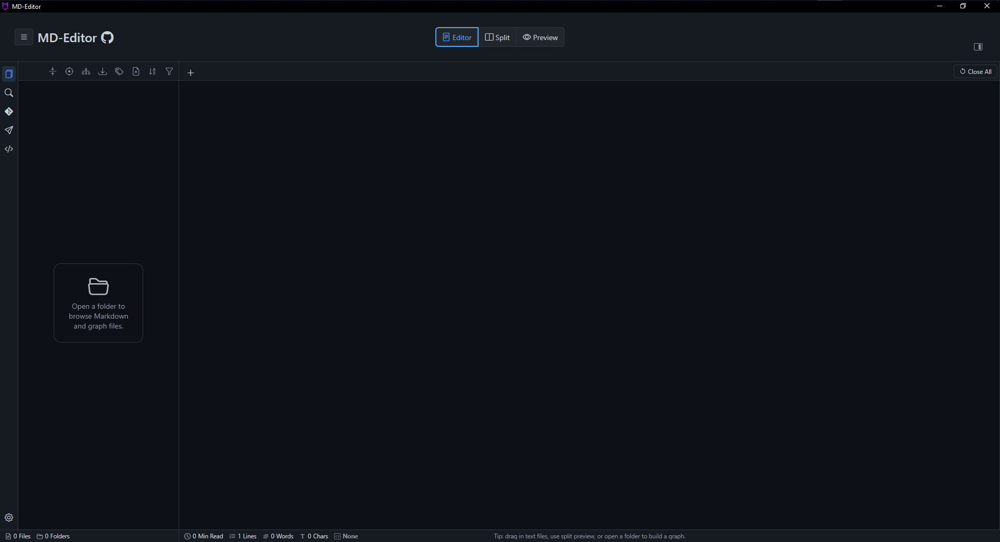
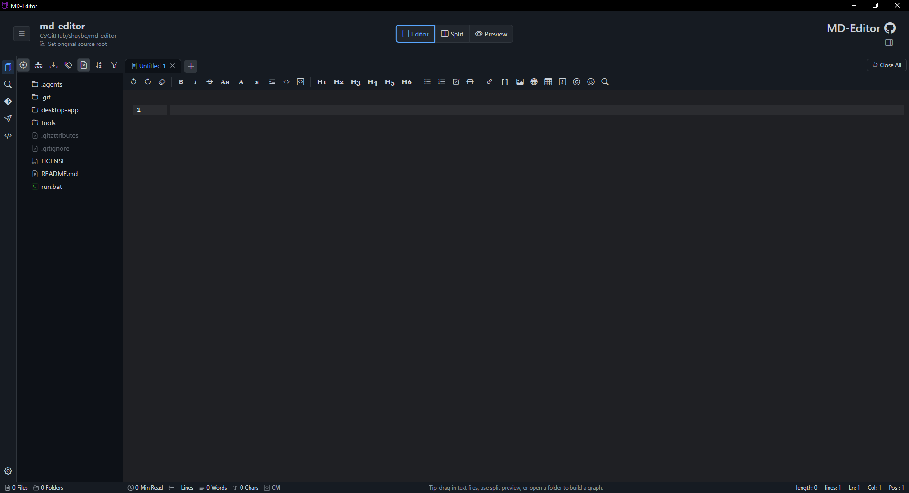
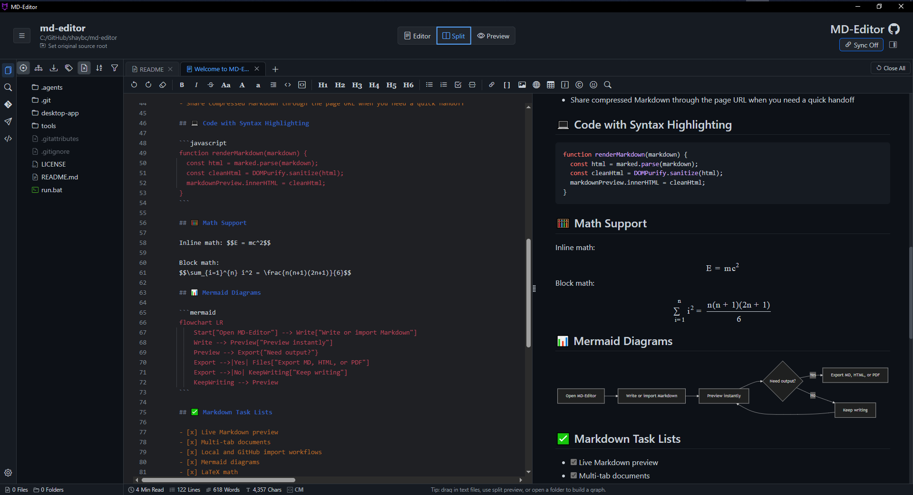
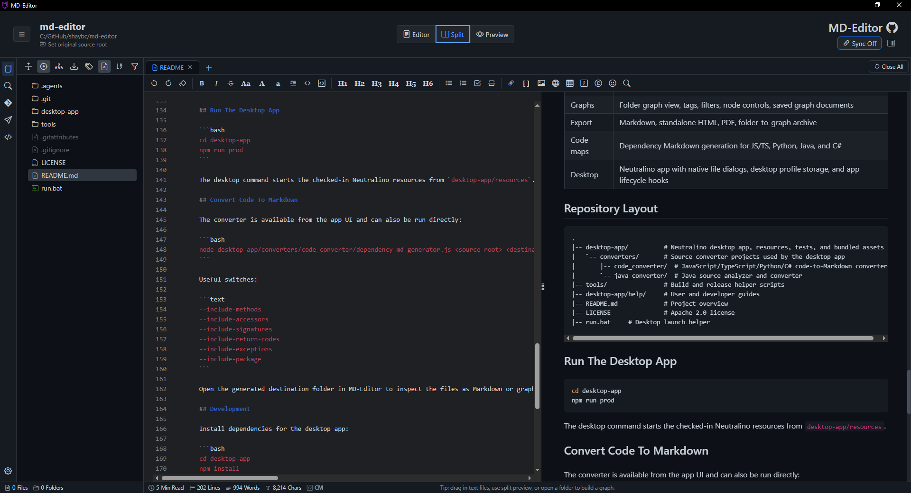
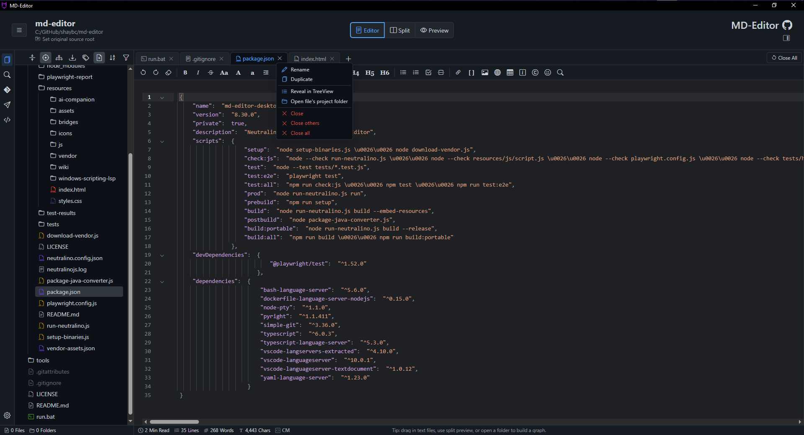
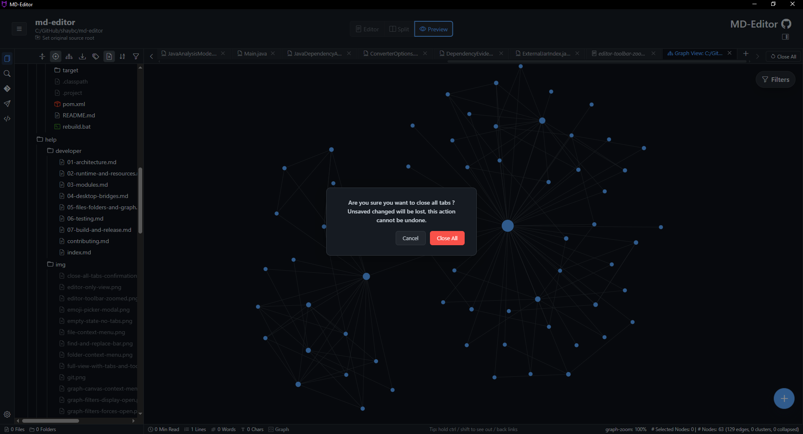

# 2. Files, Folders, And Tabs

Files, folders, and tabs are the everyday workflow in MD-Editor. A folder gives you workspace context; tabs let you move between documents, generated pages, graph views, reports, and tools without losing your place.

## 2.1. Open Files

To open one file, choose <kbd>Actions</kbd> -> <kbd>Open file...</kbd>. You can also open recent files from <kbd>Actions</kbd> -> <kbd>Recent files</kbd>.

Supported file behavior depends on file type:

| File Type | Behavior |
| --- | --- |
| Markdown | Opens in an editable Markdown tab with preview support. |
| Text/code | Opens in an editor tab with text editing and available language support. |
| HTML | Opens in a preview-safe workflow that avoids direct `file://` iframe problems. |
| JSON | Opens in the editor or large JSON viewer depending on size. |
| Graph document | Opens as a graph tab. |
| Unsupported or binary file | May open in a preview tab, external app, or remain unavailable depending on type and context. |

Useful commands:

- <kbd>Ctrl</kbd> + <kbd>S</kbd> saves the active source-backed tab.
- <kbd>Ctrl</kbd> + <kbd>R</kbd> reloads the active file from disk.
- <kbd>Actions</kbd> -> <kbd>Save As...</kbd> writes the active tab to a new path.
- <kbd>Actions</kbd> -> <kbd>Save All</kbd> writes all dirty tabs.

> Note: Temporary generated pages, help pages, and reports may not have a writable source path. Save As is the right command when you want to keep them as files.

### Built-in Hex Editor

Open any file explicitly in the built-in hex editor in one of three ways:

- Choose <kbd>Actions</kbd> -> <kbd>Open file in Hex Editor...</kbd>.
- Right-click a file in the folder tree and choose <kbd>Open in Hex Editor</kbd>.
- In an unsupported-file preview, choose <kbd>Open in Hex Editor</kbd> beside the text and default-app choices.

Opening a file normally is unchanged; no file extension is automatically associated with the hex editor. The same source can be open in both a normal tab and one durable hex-editor tab.

Files up to and including 10 MB are editable in memory. Larger files use a paged, read-only view so you can still scroll, inspect values, go to an offset, search the whole file, select bytes, and use Save As without loading the file into memory. Editing is fixed-size: typing or pasting overwrites existing bytes and cannot insert, delete, or extend the file.

The hex editor provides:

- Synchronized hexadecimal and decoded-text columns with 16 bytes per row.
- Arrow-key navigation; <kbd>Page Up</kbd>, <kbd>Page Down</kbd>, <kbd>Home</kbd>, and <kbd>End</kbd>.
- <kbd>Ctrl</kbd> + <kbd>C</kbd> and <kbd>Ctrl</kbd> + <kbd>V</kbd> for selections and overwrite paste. Selections larger than 1 MB cannot be copied.
- <kbd>Ctrl</kbd> + <kbd>Z</kbd> and <kbd>Ctrl</kbd> + <kbd>Y</kbd> for undo and redo.
- <kbd>Ctrl</kbd> + <kbd>S</kbd>, Save, and Save As. Hex paste must contain complete byte pairs and fit before the end of the file.
- Decimal offsets, `0x`-prefixed hexadecimal offsets, or hexadecimal offsets ending in `h` in the Go To field.

Search supports:

- Hex byte pairs such as `4D 5A 90 00` or `0x4D,0x5A`.
- Text searches with optional case sensitivity.
- Forward and backward search, including across paged-read boundaries.

The data inspector reads from the selected offset as signed and unsigned 8-, 16-, and 32-bit integers, plus 32- and 64-bit floating-point values. Choose little-endian or big-endian byte order from the toolbar.

Before overwriting an editable desktop file, MD-Editor compares its size and modification time with the values captured when it was opened. If the file changed externally, you can reload it, overwrite it, or save to a new path. A missing restored source displays a recoverable missing-file state.

The implementation adapts concepts from Microsoft's MIT-licensed VS Code Hex Editor; its attribution is included with MD-Editor's vendor licenses.

## 2.2. Open Folders

To open a folder, choose <kbd>Actions</kbd> -> <kbd>Open folder...</kbd>. The folder name and absolute path appear in the header, and the folder tree appears in the sidebar.

A folder workspace lets you:

- Open files by clicking them in the tree.
- Expand and collapse nested folders.
- Use tree filtering and sorting.
- Reveal files in Explorer.
- Rename, delete, copy paths, and manage tags from context menus.
- Convert source folders into generated Markdown documentation.
- Build graphs from Markdown links, wiki links, tags, and generated dependency maps.

To close the active folder, choose <kbd>Actions</kbd> -> <kbd>Close Folder</kbd>. Closing the folder clears the folder tree and removes folder-specific status information.

## 2.3. Folder Tree Toolbar

The toolbar above the tree keeps high-frequency folder actions close to the files.

Common controls:

| Control | Purpose |
| --- | --- |
| Expand/collapse | Open or close visible tree folders. |
| Auto-select | Keep the tree selection synchronized with the active tab. |
| Graph/relationship controls | Open graph-related folder workflows. |
| Download/export | Export folder or graph content when available. |
| Tags | Show tag tools for Markdown files and graph organization. |
| Unsupported files | Show or hide files outside the default Markdown/document set. |
| Sort | Sort by name, modified time, or created time when metadata is available. |
| Filter | Narrow the tree by filename. |

> Tip: When a folder is very large, use filtering or <kbd>Ctrl</kbd> + <kbd>Shift</kbd> + <kbd>N</kbd> to open by name instead of expanding every branch by hand.

For the detailed behavior of auto-select, sorting, filtering, tag tools, unsupported-file visibility, and file/folder right-click actions, see [Folder Toolbar And Context Menus](folder-toolbar-and-context-menus.md).

## 2.4. Context Menus

Right-click files and folders in the tree for local actions.

File actions commonly include:

- Open in a tab.
- Reveal in Explorer.
- Open original source for generated Markdown when source-root metadata exists.
- Rename or delete.
- Copy path, name, or Markdown link.
- Add or remove tags.
- Show file in Graph View.

Folder actions commonly include:

- Reveal in Explorer.
- Rename or delete the folder.
- Set original source root.
- Convert code to Markdown from that folder.
- Export folder to graph.
- Run graph or recovery workflows.

> Caution: Delete and rename actions affect real files on disk. Keep confirmation prompts enabled until you are comfortable with the workflow.

For the full menu reference, including original-source actions and generated-project actions, see [Folder Toolbar And Context Menus](folder-toolbar-and-context-menus.md).

## 2.5. Tabs

Tabs preserve multiple working surfaces at once. A tab can represent a Markdown document, graph, API request, file preview, compare view, generated report, Help page, or unsaved note.

The empty tab state is the clean starting point. From there you can create a note, open an existing file, open a folder, or use recent files and folders. This matters when you want to begin a focused writing session without restoring older context.

A new untitled tab is a scratch space for drafting content before choosing a save location. Use it for quick notes, pasted snippets, temporary Markdown, or a draft that may become a real file later.

Multiple tabs let you keep related surfaces together: source Markdown, generated reports, graph views, previews, API requests, and compare tabs. This reduces context switching when you are reviewing a project from several angles.

Split view is especially useful in tab-heavy work because you can keep the active document editable while checking the rendered output beside it.

Tab actions:

- Click a tab to switch to it.
- Drag tabs to reorder them.
- Double-click a tab to maximize or restore the tab surface.
- Use the tab close button to close one tab.
- Use <kbd>Close All</kbd> to close the whole tab set.

- Right-click a tab for rename, duplicate, close, reset, reveal, or source actions when available.

Temporary tabs are useful for quick previews. Open or pin a tab when you want it to stay while navigating elsewhere.

## 2.6. Large Folders

Folders can contain hundreds of thousands of files. MD-Editor opens folders as a lazy-loaded top-level tree so the workspace appears before nested content is read.

For large or deeply nested folders:

- Prefer opening files by name with <kbd>Ctrl</kbd> + <kbd>Shift</kbd> + <kbd>N</kbd>.
- Keep unsupported files hidden unless you need them.
- Filter the tree before expanding deep folders.
- Avoid bulk expand-all actions unless you know the folder is small enough.
- Use workspace search when you know content text but not the file location.

> Note: Exact recursive counts may take longer than the visible tree. File opening should stay responsive while counts or metadata are still settling.

Previous: [1. Essentials](01-essentials.md)  
Next: [3. Editing And Preview](03-editing-and-preview.md)
