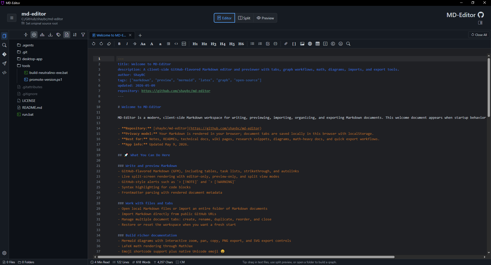
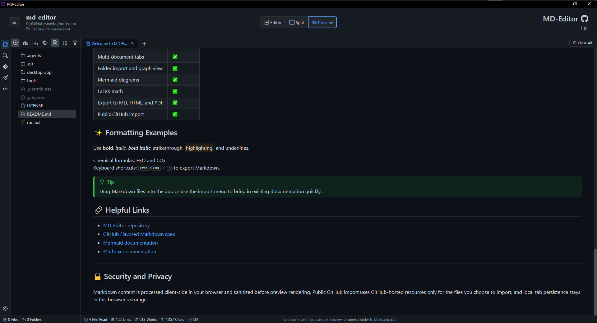
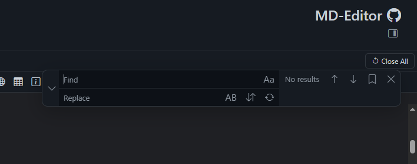
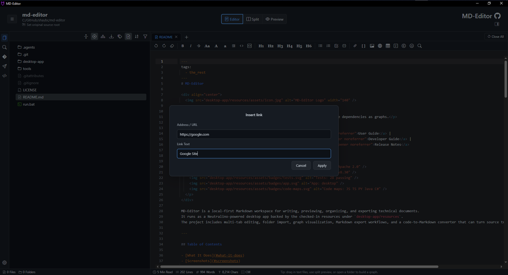
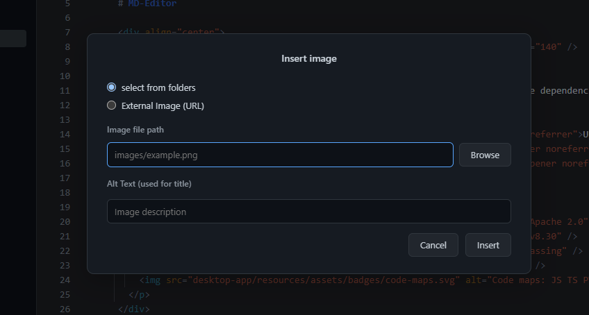
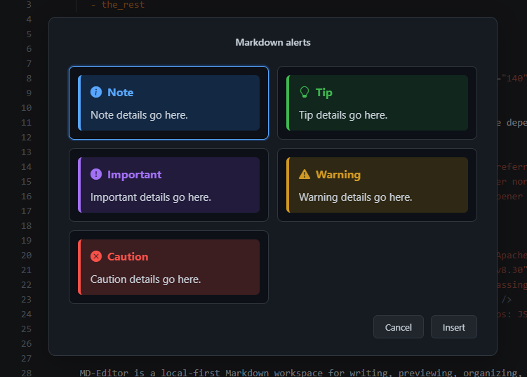
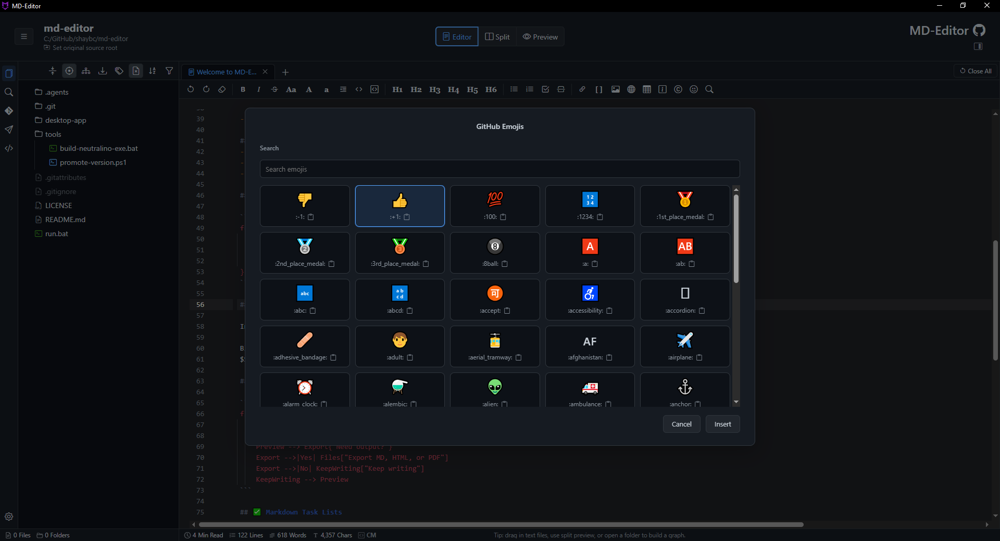
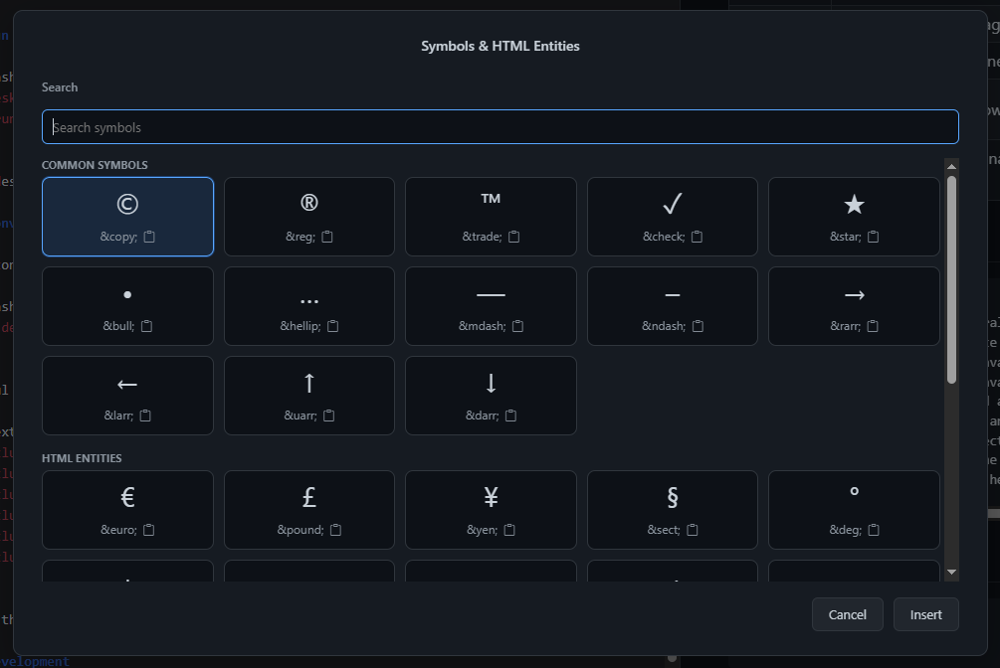

# 3. Editing And Preview

Editing is where MD-Editor should save you context switching. Instead of writing in one app, previewing in another, and exporting from a third, you can keep authoring, review, linking, diagrams, and output checks in one workspace.

## 3.1. Editor, Split, And Preview

Use the view buttons in the header to choose how much of the writing surface you want.

- <kbd>Editor</kbd> gives the most room for writing and bulk edits. It is best when you are drafting, pasting code, or making line-level changes.
- <kbd>Split</kbd> keeps the editor and rendered preview side by side. It is best when tables, diagrams, links, or math must be checked while writing.
- <kbd>Preview</kbd> turns the tab into a reading surface. It is best for final review, following links, and export checks.

Business benefit: the view modes let you change the amount of feedback you need without changing tools. Draft quickly in Editor, verify structure in Split, then read the finished result in Preview.

> Tip: Use Split mode for documents with Mermaid or MathJax. You can catch syntax or layout problems while the context is still fresh.

## 3.2. Markdown Formatting

The formatting toolbar provides common Markdown commands without requiring you to remember every syntax marker.

 The same commands are also available through menu actions and editor shortcuts.

Common commands:

| Command | Use It For |
| --- | --- |
| Bold, italic, strikethrough | Emphasize important technical terms, warnings, or changed values. |
| Headings H1-H6 | Build document hierarchy that preview, links, and readers can scan. |
| Lists and task lists | Turn procedures, checklists, and acceptance criteria into structured content. |
| Link and image tools | Connect local docs, source references, screenshots, and external resources. |
| Table tool | Create comparison tables without hand-counting pipes. |
| Alert tool | Add GitHub-style notes, tips, warnings, and important callouts. |
| Code tools | Keep commands, snippets, and examples readable and copyable. |

Keyboard shortcuts:

| Action | Shortcut |
| --- | --- |
| New document | <kbd>Ctrl</kbd> + <kbd>T</kbd> |
| Duplicate line | <kbd>Ctrl</kbd> + <kbd>D</kbd> |
| Save file | <kbd>Ctrl</kbd> + <kbd>S</kbd> |
| Reload from disk | <kbd>Ctrl</kbd> + <kbd>R</kbd> |

Business benefit: formatting commands reduce the friction between thinking and documenting. The less time you spend on syntax, the more attention you can give to the content itself. For syntax examples, see [Markdown Reference](markdown-reference.md). For every toolbar button and modal action, see [Editor Toolbar And Modal Actions](editor-toolbar-and-modals.md).

## 3.3. Find And Replace

Use <kbd>Actions</kbd> -> <kbd>Find</kbd> for search workflows.

| Tool | Shortcut | Best For |
| --- | --- | --- |
| Find | <kbd>Ctrl</kbd> + <kbd>F</kbd> | Searching inside the active document. |
| Find / Replace | <kbd>Ctrl</kbd> + <kbd>H</kbd> | Changing repeated text in the active document. |
| Find in Workspace | <kbd>Ctrl</kbd> + <kbd>Shift</kbd> + <kbd>F</kbd> | Searching the opened folder by filename and content. |
| Open File by Name | <kbd>Ctrl</kbd> + <kbd>Shift</kbd> + <kbd>N</kbd> | Jumping directly to a file in a large folder. |
| Find in Files | <kbd>Ctrl</kbd> + <kbd>Alt</kbd> + <kbd>F</kbd> | Running a scoped cross-file search with file masks and options. |
| Show / Hide Results | <kbd>F7</kbd> | Keeping search results available while editing. |

Find in Files supports match case, whole word, regular expression, and include-subfolders options. This makes it useful for project-wide audits such as finding old package names, deprecated terms, TODO markers, API names, or broken references. For the detailed workflow differences between Find, Workspace Search, Open File by Name, and Find in Files, see [Search Workflow Details](search-workflows.md).

Business benefit: search features turn a folder from a pile of files into a navigable knowledge base. You can answer �where is this documented?� without leaving the editor.

## 3.4. Links, Images, Tables, Alerts, And Symbols

Documents become more valuable when they connect to the rest of your workspace.

- Use Markdown links for normal URLs and local document references.
- Use wiki links such as `[[Architecture]]` for note-style connections and graph relationships.
- Insert images for screenshots, diagrams, and UI references.
- Use tables for comparisons, option matrices, release notes, and API summaries.
- Use alerts for notes, tips, warnings, and important operational details.
- Use emoji and symbols sparingly for visual scanning when they clarify meaning.

Business benefit: connected documents are easier to maintain. Links and wiki links also feed Graph View, so documentation can become an explorable relationship map instead of isolated pages.

> Note: Relative links in bundled Help pages open inside MD-Editor. Relative links in user documents resolve against the active document or workspace path when the app has enough source information.

## 3.5. Rich Preview Features

The preview renderer supports technical Markdown features that are hard to review in a plain text editor.

| Feature | Why It Helps |
| --- | --- |
| Mermaid | Describe flows, sequence diagrams, dependency shapes, and state changes as text. |
| MathJax | Keep formulas readable in research, engineering, or data notes. |
| Frontmatter | Show metadata such as tags, source files, generated package names, and graph data. |
| Syntax highlighting | Make code examples easier to review and copy. |
| GitHub alerts | Standardize notes, warnings, and important blocks across docs. |
| Heading anchors | Make long documents linkable by section. |

Business benefit: rich preview lets technical documents carry diagrams, metadata, code examples, and explanations together. That reduces stale sidecar files and keeps review closer to the source text.

## 3.6. Export

Exports let you share the finished work outside MD-Editor.

Common export targets:

- Markdown for source-controlled documentation.
- Standalone HTML for readable local or portable pages.
- PDF for review, handoff, or archival use.
- Graph documents and graph archives for relationship maps.
- Mermaid SVG/PNG exports for diagram reuse.

Business benefit: you can keep Markdown as the editable source of truth while still producing formats that different audiences need.

## 3.7. Java Quick Fix

The Problems panel can show live Java diagnostics published by Eclipse JDT LS alongside saved Maven or javac build problems. Hover over marked Java text to see fixes for that exact live diagnostic, or place the caret in the marked text and press **F2**. Click a suggested fix to open the Quick Fix dialog with that action selected and previewed. Choose **Open Quick Fix...** to inspect the complete list instead. You can also right-click a located Java problem in the Problems panel and choose **Quick Fix...**.

The Quick Fix dialog:

- Labels language-server actions as **JDT** and keeps AI proposals separate.
- Shows preferred and unavailable actions, including the server's reason when provided.
- Resolves the selected action and displays every affected file or resource operation before Apply is enabled.
- Applies source edits as unsaved editor changes, so normal Save behavior remains under your control.
- Offers **Undo Quick Fix** for the complete grouped change.
- Rechecks the original JDT diagnostic after application.
- Offers **Rebuild project** as an explicit follow-up; it does not build automatically.

Create, rename, and delete operations are limited to the active workspace. Quick Fix refuses stale versions, overlapping edits, path escapes, conflicting destinations, and server commands that cannot be previewed safely.

When Agent mode is enabled, **AI: investigate and propose a fix...** opens AI Companion with the complete diagnostic and current source context. AI edits continue to use the Companion's normal approval and activity trail.

Live JDT diagnostics are owned by the language server and cannot be deleted from the Problems panel. Existing saved build diagnostics keep their current deletion behavior.

Previous: [2. Files, Folders, And Tabs](02-files-folders-tabs.md)  
Next: [4. Graph View](04-graph-view.md)