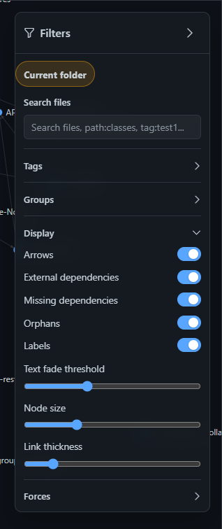
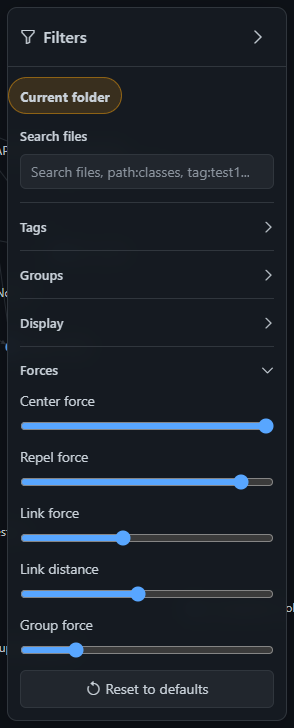
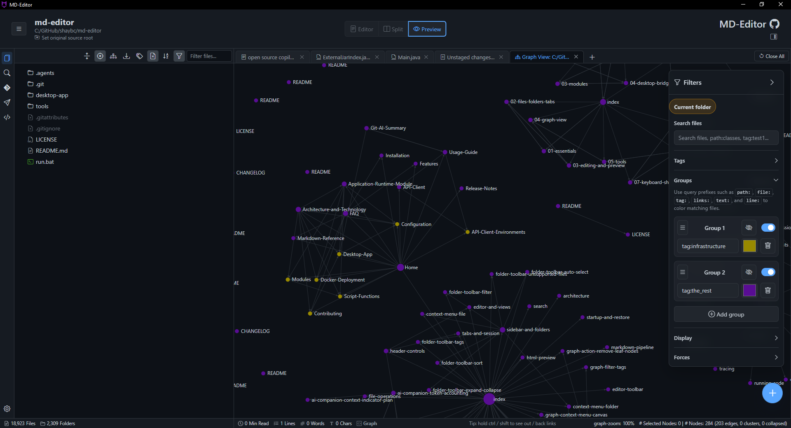
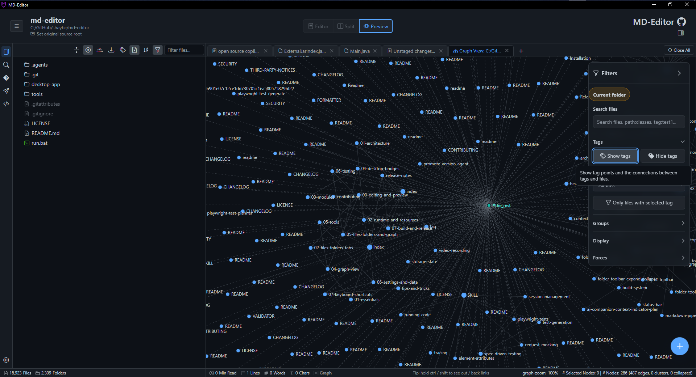

# 4. Graph View

Graph View turns documents and generated code maps into a visual relationship model. It helps you see what depends on what, which files are central, which notes are isolated, and where links or dependencies are broken.

## 4.1. Create A Graph

You can create a graph from an opened folder, selected folder tree actions, generated code maps, or saved graph documents.

Common entry points:

- Open a folder, then use the graph action from the folder toolbar.
- Right-click a folder and choose the graph-related action.
- Open a saved graph document from disk.
- Convert a source project to Markdown, then graph the generated output folder.

Graph View reads relationships from Markdown links, wiki links, tags, generated dependency metadata, source-root metadata, and saved graph state.

Business benefit: Graph View makes hidden relationships visible. It is especially useful when reviewing generated code documentation, onboarding into a project, or finding central files before refactoring.

## 4.2. Navigate The Graph

Use mouse and toolbar controls to inspect the graph.

Common interactions:

- Drag the canvas to pan.
- Zoom to inspect dense areas or see the whole graph.
- Click a node to select it and inspect connected relationships.
- Double-click or use node actions to open files.
- Use search to focus a file, path, tag, or text pattern.
- Center the graph when the layout drifts away from the viewport.

Business benefit: navigation turns a large dependency map into an exploratory tool. You can move from a high-level overview to a specific file without losing context.

## 4.3. Filter And Group

Filters help you remove noise without changing the source documents.

Useful filters and grouping tools:

| Control | Business Benefit |
| --- | --- |
| Search filter | Quickly find files, tags, links, or text matches in a dense graph. |
| Tags filter | Focus on product areas, components, topics, or workstreams. |
| Groups | Create durable visual sets for modules, layers, teams, or review scope. |
| Display settings | Hide or show labels, arrows, orphan nodes, external dependencies, and missing nodes. |
| Force settings | Make dense graphs tighter, calmer, or more spread out. |
| Cluster controls | Collapse related nodes so a large graph becomes readable. |

> Tip: Start by hiding orphan nodes and labels on very large graphs. Add labels back after you have narrowed the graph to the area you are studying. For a full control reference, see [Detailed Graph View Controls](graph-view-controls.md).

## 4.4. Node Actions

Right-click graph nodes for context actions.

Common node actions include:

- Open the Markdown file in a tab.
- Reveal the file in the folder tree or in Explorer.
- Open the original source file for generated Markdown when source-root metadata exists.
- Copy file paths or links.
- Add, remove, or inspect tags.
- Collapse, hide, group, or delete graph nodes depending on graph mode.
- Export original nodes or related source files when available.

Business benefit: graph nodes are not only visual markers. They are navigation handles into the real files and the source project behind generated documentation.

## 4.5. Health And Recovery

Graph health tools help find problems that are easy to miss in a file tree.

Health reports can surface:

- Broken Markdown links.
- Missing generated dependency targets.
- Unresolved source roots.
- Missing Java dependency information.
- Maven or external JAR recovery opportunities.
- Files that are disconnected from the rest of the graph.

Business benefit: health reports convert documentation maintenance from manual checking into a guided review. They are useful before sharing generated docs or before using a graph as a refactoring map. For Java recovery steps, see [Maven Dependency Recovery And Update Project](maven-dependency-recovery.md).

Previous: [3. Editing And Preview](03-editing-and-preview.md)  
Next: [5. Tools](05-tools.md)