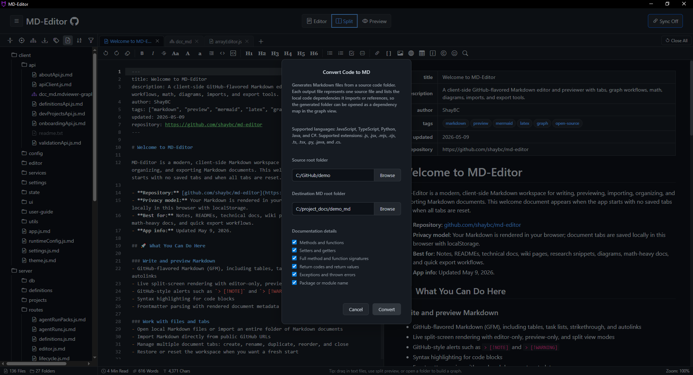
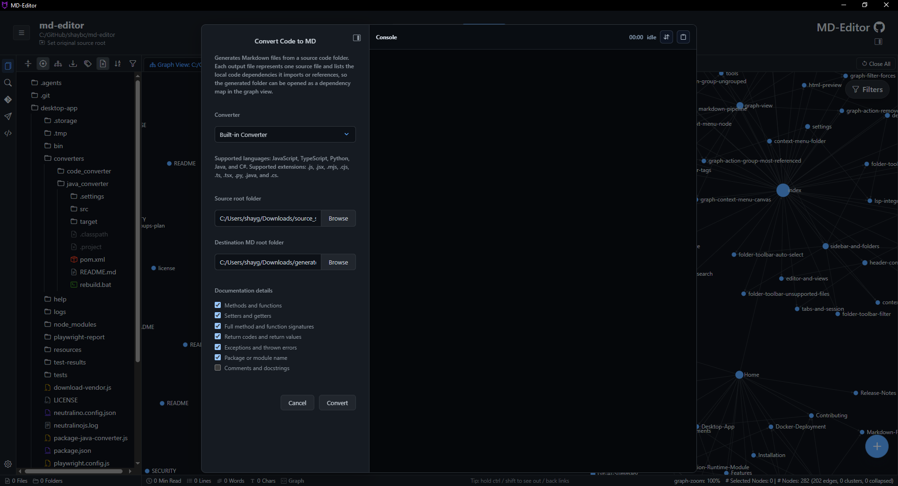
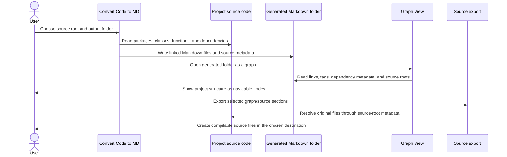
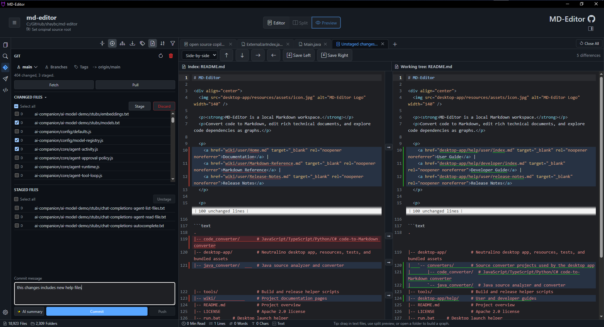
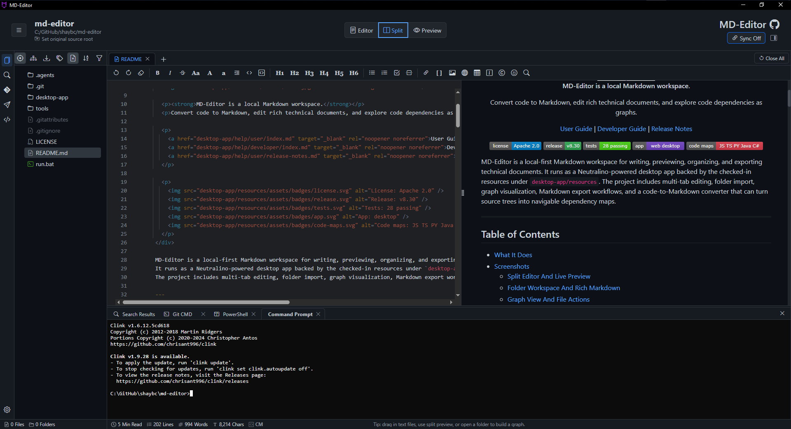
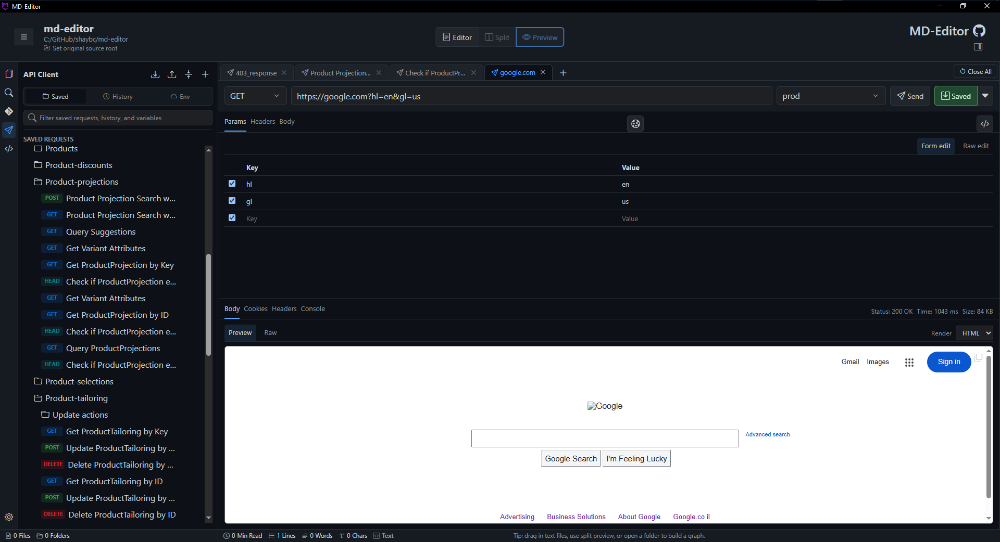
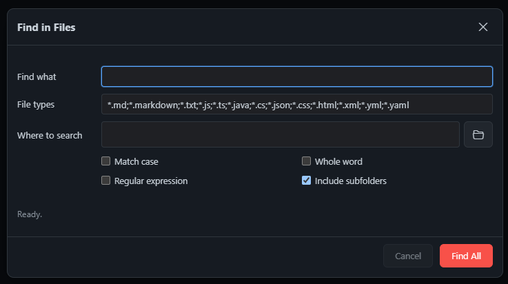
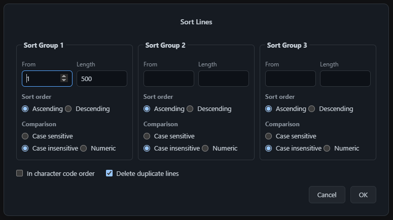

# 5. Tools

Tools extend MD-Editor beyond document editing. They help you convert code, inspect repositories, run local commands, compare files, search workspaces, and test APIs without leaving the documentation context.

## 5.1. Code To Markdown

Open <kbd>Actions</kbd> -> <kbd>Tools</kbd> -> <kbd>Convert Code to MD</kbd> to generate Markdown documentation from source folders.

The converter dialog lets you choose a source root, choose a destination folder, select the source language, and decide how much implementation detail belongs in the generated Markdown. Progress and console output help you see whether conversion is still running, completed, cancelled, or needs attention.

Supported languages:

- JavaScript
- TypeScript
- Python
- Java
- C#

Useful options include method extraction, accessor extraction, signatures, return codes, exceptions, package/module metadata, Java external dependencies, and Maven dependency resolution.

Business benefit: code conversion turns a source tree into a readable, linkable documentation set. Once converted, the output can be edited, searched, previewed, graphed, exported, and reviewed like any other Markdown folder.

> Tip: Convert into a separate output folder. That keeps generated docs easy to delete, regenerate, compare, or commit independently from the source project. For Java Maven recovery after graph health reports, see [Maven Dependency Recovery And Update Project](maven-dependency-recovery.md).

## 5.2. Git Panel

The Git panel is for repository-aware work inside the opened folder.

 It can show status, staged and unstaged changes, branches, tags, diffs, stash data, conflict surfaces, and commit controls.

Common uses:

- Review changed files while editing docs.
- Open diffs before committing generated or manual documentation updates.
- Switch branches from the workspace context.
- Create commit messages and summaries when the AI Companion Git summary feature is enabled.
- Inspect conflicts and open compare views.

Business benefit: Git integration keeps documentation changes close to version control. You can write, review, compare, and commit without losing the workspace path you are documenting.

For branch, stash, conflict, diff, and AI summary details, see [Git Panel Guide](git-panel-guide.md).

## 5.3. Terminal

The desktop terminal opens local command profiles in the current workspace context.

 Typical profiles include CMD, PowerShell, Git CMD, and Git Bash when available.

Use it to:

- Run project scripts from the opened folder.
- Build or test generated code documentation workflows.
- Inspect repository state with command-line tools.
- Keep terminal output near the files being edited.

Business benefit: terminal integration prevents the common “which folder is my terminal in?” problem. Commands start from the same workspace you are viewing in MD-Editor.

## 5.4. API Client

The API Client is a desktop request workspace. It supports saved requests, folders, environments, variables, recent history, response preview modes, import/export, code snippets, cookies, settings, and API-agent tools.

For the full workflow, saved request usage, response inspection, Postman import/export, settings, AI Companion integration, and the environments tutorial, see [API Client](api-client.md).

Business benefit: API notes and runnable requests can live in the same workspace. That makes API documentation easier to verify and harder to let drift.

## 5.5. Line Counter

Line Counter scans the opened folder, counts lines in readable text/code files, and opens a report sorted from the largest files to the smallest.

Open <kbd>Actions</kbd> -> <kbd>Tools</kbd> -> <kbd>Line Counter</kbd>.

Use it to:

- Find unusually large source or documentation files.
- Count only a configured folder inside the opened workspace.
- Exclude folders such as `node_modules`, `.git`, `bin`, `logs`, `dist`, and `target`.
- Exclude binary or packaged file types such as `.exe`, `.zip`, `.png`, `.jar`, and `.pdf`.
- Save the Line Counter dialog values as user preferences, or reset them to the built-in defaults.

The report opens as a Markdown preview tab. Its summary is collapsed by default, each file name links back to the counted file, and pressing <kbd>Ctrl</kbd>+<kbd>S</kbd> saves the report as an HTML file.

Business benefit: line counting makes project size hotspots visible without leaving MD-Editor, while the exclusions keep generated, dependency, log, and binary content out of the result.

## 5.6. Search Tools

Search tools overlap intentionally because they solve different navigation problems.

| Tool | Best Business Use |
| --- | --- |
| Workspace Search | Quickly answer where a concept, file, or path appears in the current folder. |
| Find in Files | Audit repeated terms, deprecated names, migration targets, or generated docs across file masks. |
| Open File by Name | Jump through large folders without expanding the tree. |
| Find/Replace | Make precise changes in the active file. |

For search scope, filters, replacement behavior, and results panels, see [Search Workflow Details](search-workflows.md).

## 5.7. File Compare And Sort Lines

File Compare opens two sources side by side and can also support conflict-resolution workflows. Sort Lines helps normalize selected text, lists, generated output, or tabular sections.

Sort Lines is useful for alphabetizing lists, removing duplicate lines, or normalizing generated output before committing documentation changes.

Business benefit: compare and sorting tools reduce the need for external utilities during review. They are especially useful when cleaning generated Markdown, reconciling conflict files, or comparing before/after converter output.

Previous: [4. Graph View](04-graph-view.md)  
Next: [6. Settings And Data](06-settings-and-data.md)
