---
tags:
  - the_rest
---
# 6. Settings And Data

Settings let you adapt MD-Editor to the way you work: quiet writing, dense project navigation, large graph analysis, language-server-assisted editing, or repeatable conversion workflows.

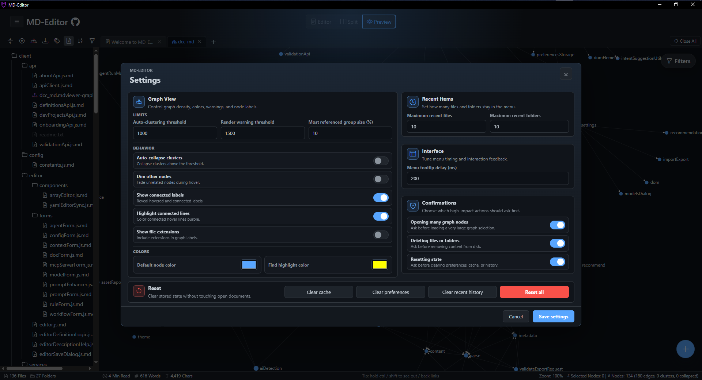

## 6.1. Interface Settings

Open <kbd>Actions</kbd> -> <kbd>Settings...</kbd>, then choose <kbd>Interface</kbd>.

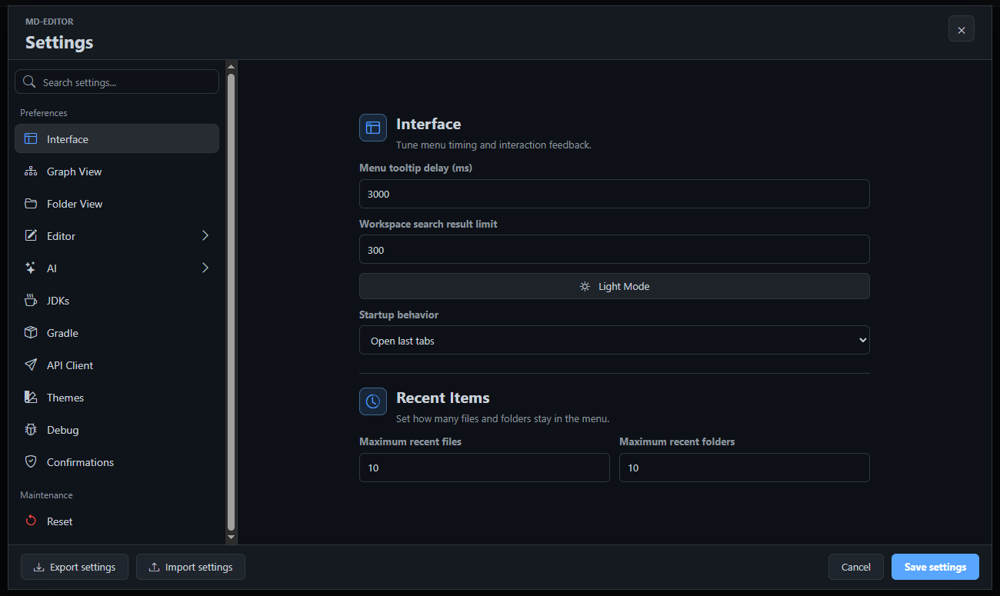

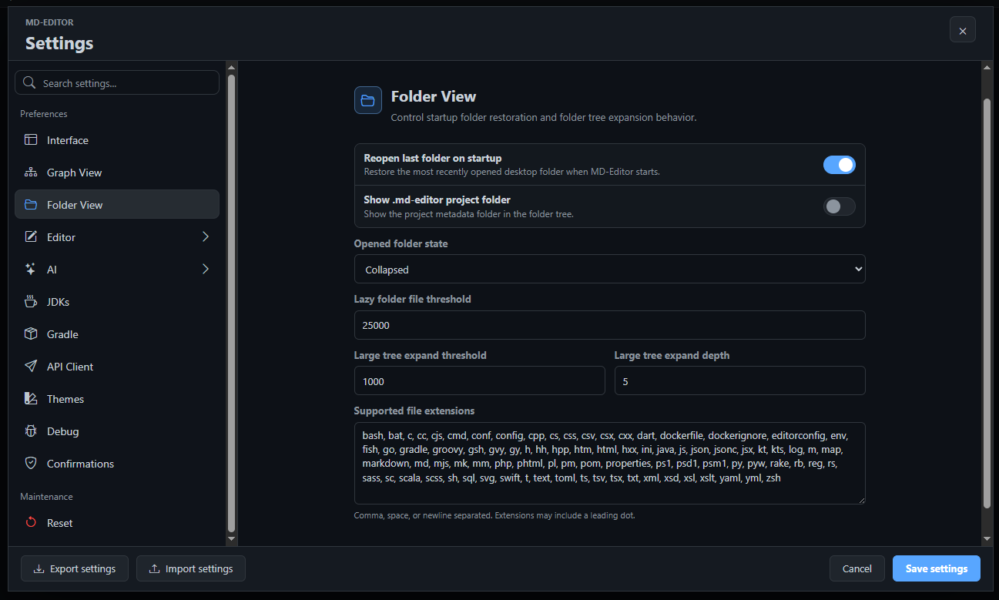

Interface settings affect startup, workspace restoration, file opening modes, folder behavior, editor sizing, and visible UI surfaces. Folder View settings focus on lazy-loaded folder navigation, unsupported-file visibility, sorting, filtering, and tree behavior.

Choose <kbd>Interface</kbd> -> <kbd>File Opening Modes</kbd> to select Editor, Split, or Preview for each supported extension and special filename. Untitled files open in Editor by default; Markdown extensions, HTML files, README, and CHANGELOG open in Split; other supported types open in Editor. Search narrows the list, <kbd>Set all</kbd> applies one mode to every listed type, and <kbd>Restore defaults</kbd> restores those built-in choices. Custom extensions added in Folder View appear in this list. Saved changes affect files opened afterward and do not change existing tabs.

Common decisions:

| Setting Area | Business Benefit |
| --- | --- |
| Startup behavior | Start exactly where you left off, with a blank document, or with an empty workspace depending on your workflow. |
| File opening modes | Choose an Editor, Split, or Preview default independently for each supported file type. |
| Restore last folder | Reopen long-running documentation or source-analysis projects automatically. |
| Folder lazy loading | Open folders quickly by showing top-level content first and loading nested content on demand. |
| Sidebar/dropzone/status bar visibility | Keep the UI focused for writing or expanded for project navigation. |
| Editor font and wrapping | Make long-form writing or code-heavy documentation comfortable to read. |

> Tip: If you use MD-Editor mostly for writing, hide the dropzone and AI Companion panel. If you use it for project analysis, keep the sidebar and status bar visible.

## 6.2. Editor And Theme Settings

Theme, syntax color, and editor settings control visual comfort and scan speed.

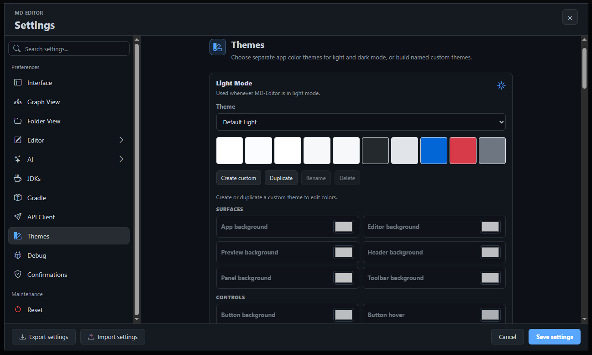

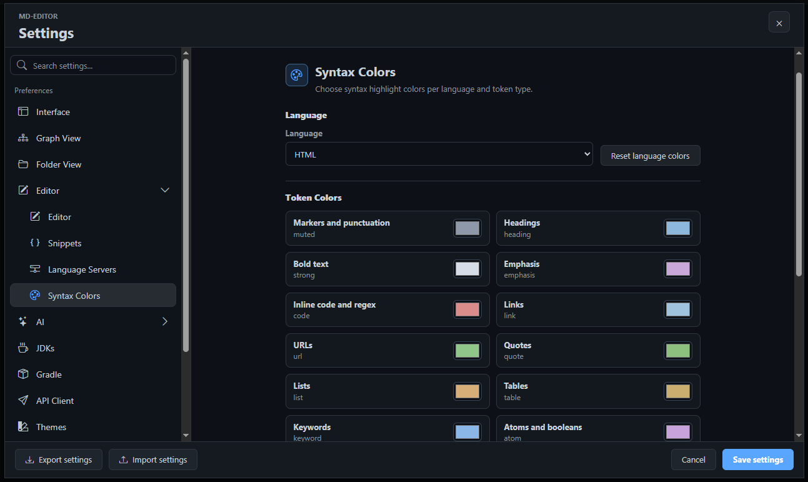

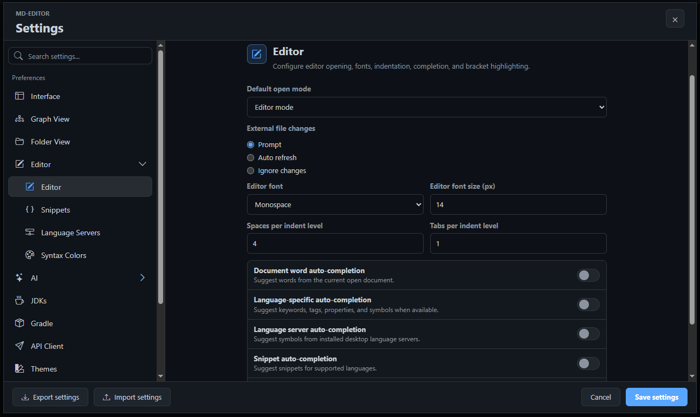

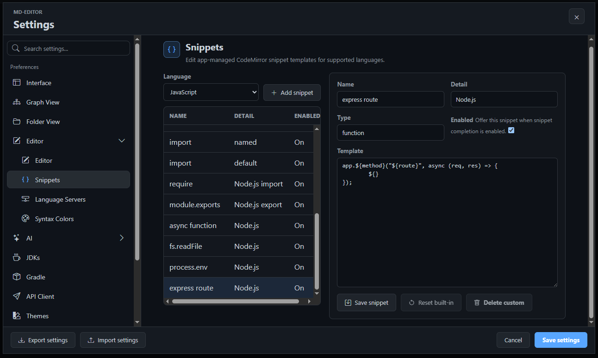

Use these settings to:

- Choose light and dark app themes.
- Customize syntax colors for Markdown and code blocks.
- Adjust editor font family and size.
- Control indentation behavior.
- Enable or disable autocomplete helpers.
- Manage snippets for repeated phrases, code patterns, or Markdown structures.

Business benefit: visual settings reduce fatigue. Snippets and editor preferences reduce repetitive typing, especially when you write the same documentation structures often.

## 6.3. Graph Settings

Graph settings shape how relationship maps behave and render.

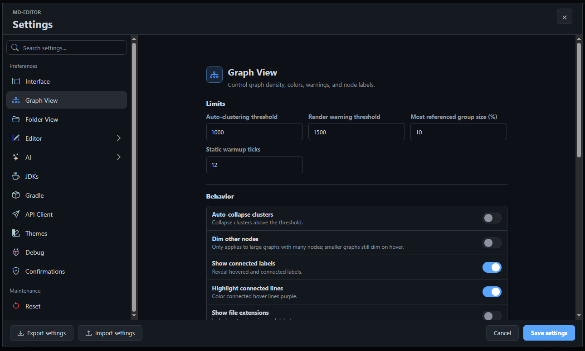

Useful controls:

- Default display of labels, arrows, orphan nodes, external dependencies, and missing dependencies.
- Layout force settings for dense or sparse graphs.
- Grouping and tag behavior.
- Persistence behavior for graph documents and drafts.
- Graph view defaults for generated dependency maps.

Business benefit: graph preferences let you tune the app for your graph size. A small note vault and a generated codebase dependency graph need different defaults.

## 6.4. Language Servers

Language servers provide editor assistance for supported code and configuration files.

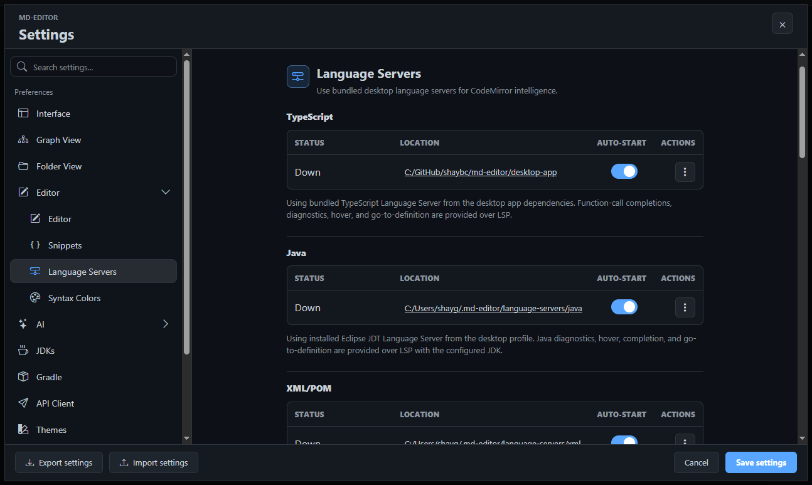

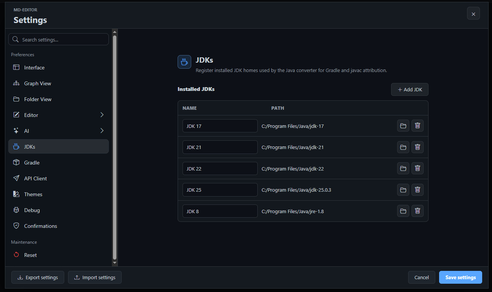

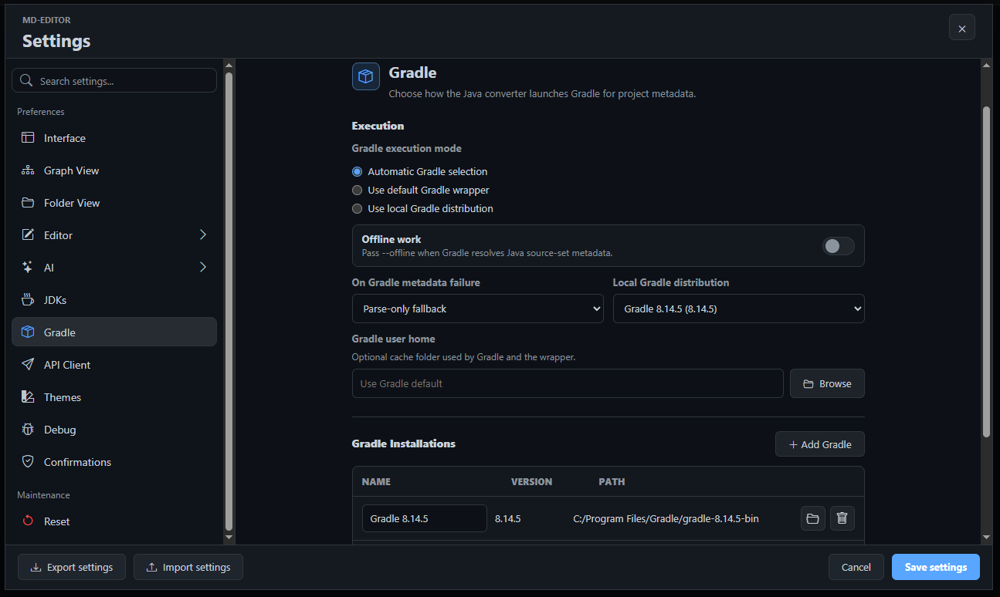 They can add completions, hover information, diagnostics, and source-aware editing support.

Language-server settings cover installed servers, autostart behavior, status, Java toolchain choices, Gradle settings, and debug information.

Business benefit: language-server support makes MD-Editor more useful for mixed Markdown/code work. You can document source files and still get code-aware help in nearby tabs.

> Note: Language servers are desktop-only because they launch local processes.

## 6.5. Profile Data

The desktop app stores profile data locally. This includes preferences, recent items, tab sessions, drafts, API Client data, AI Companion data, and other app state.

Common maintenance actions:

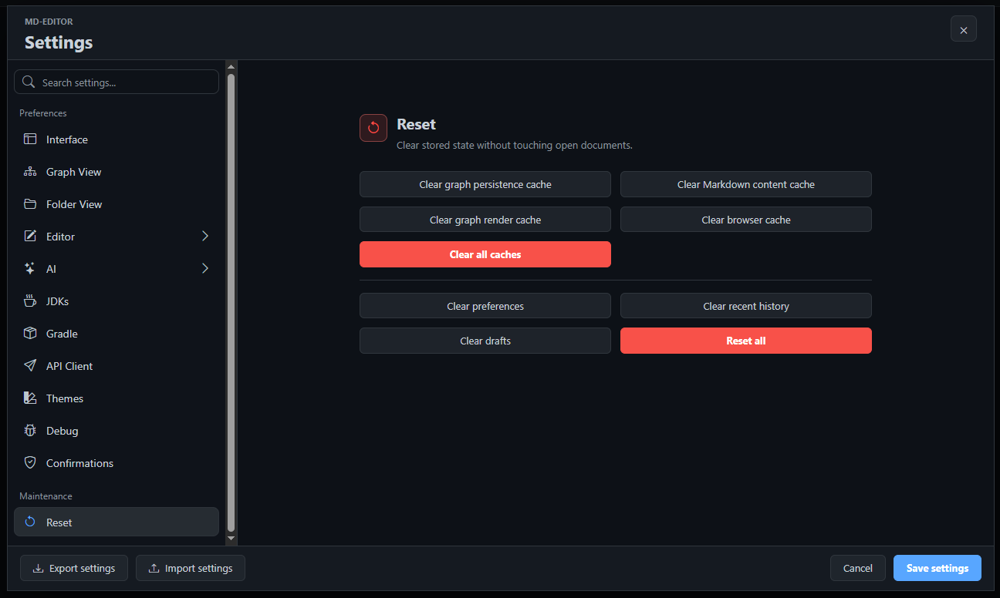

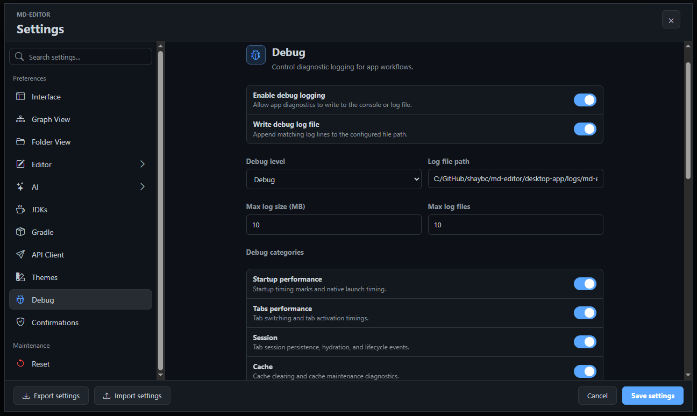

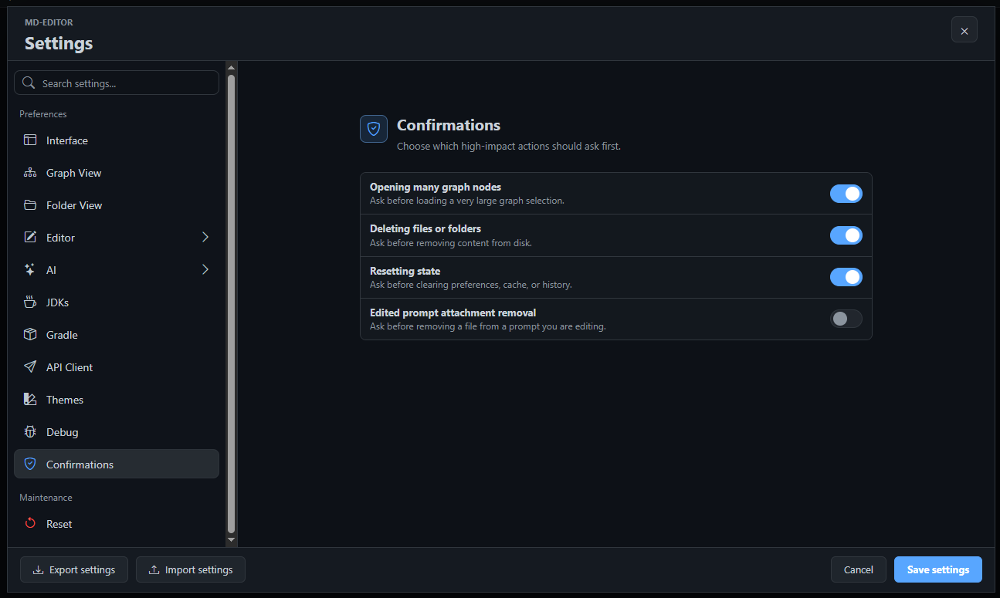

- Export settings to move preferences to another machine.
- Import settings from a saved settings JSON file.
- Reset cache when rendered or generated state looks stale.
- Reset preferences when the UI configuration becomes confusing.
- Open the profile data location when you need to inspect local app files.

Business benefit: profile data lets MD-Editor remember your workspace without requiring an account or server. Export/import gives you a practical way to move preferences while keeping document storage local.

## 6.6. API Client Settings

API Client settings tune how desktop HTTP requests behave.

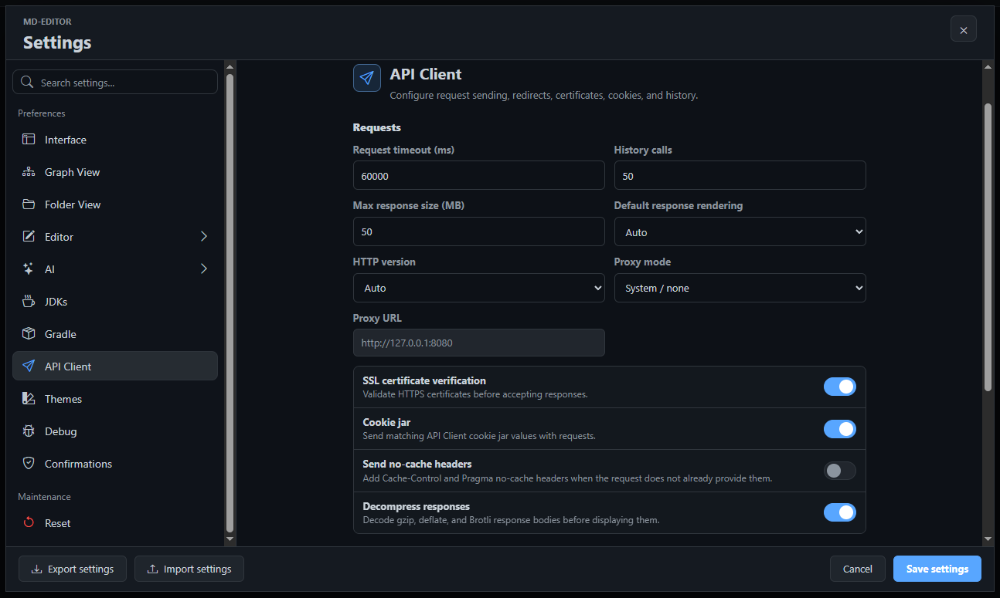

For the full settings list and how those options fit into saved requests, environments, responses, cookies, redirects, proxies, and response rendering, see [API Client Settings](api-client.md#api-client-settings).

Business benefit: API settings let you make request testing match your environment. A local service, a corporate proxy, and a large JSON API often need different timeout, proxy, redirect, and response-size behavior.

## 6.7. AI Companion Settings

AI Companion settings control whether AI features are available, which provider and model receive requests, and how much authority the assistant has inside the workspace. The settings area is the entry point for enabling Chat, Agent, Plan, Autocomplete, Git summary, model registry data, debug logging, and approval policies.

For the full workflow guide, start with [8. AI Companion](08-ai-companion/index.md). For setup details, see [8.1. Settings And Models](08-ai-companion/01-settings-and-models.md). For supplier-specific values, see [8.6. AI Provider Setup Recipes](08-ai-companion/06-provider-setup-recipes.md). For approval behavior, see [8.3. Agent And Plan Mode](08-ai-companion/03-agent-and-plan-mode.md).

Business benefit: AI settings let you use assistance at the right trust level. You can keep chat read-only, enable autocomplete for writing speed, allow agent work only with confirmations, or explicitly approve repeatable local commands when a workflow is stable.
Previous: [5. Tools](05-tools.md)  
Next: [7. Keyboard Shortcuts](07-keyboard-shortcuts.md)

