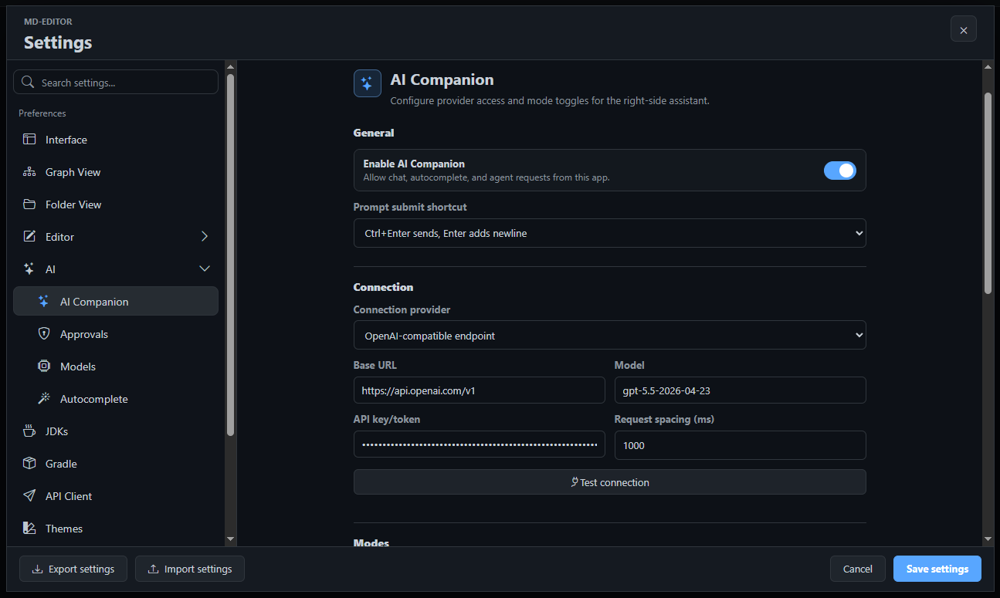
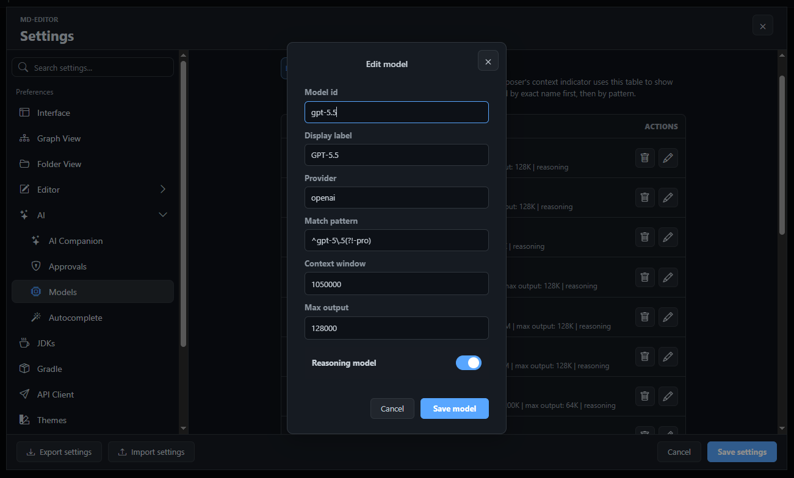

# 8.1. AI Companion Settings And Models

Settings decide whether AI Companion is available, which provider receives requests, which model is used, how much output is allowed, and which actions need confirmation. This page is the best starting point when the panel opens but cannot answer yet, when autocomplete does not appear, or when you want to use a different local or remote model.

Open settings from <kbd>Actions</kbd> -> <kbd>Settings...</kbd> -> <kbd>AI</kbd>.

## Main AI Companion Settings

The main <kbd>AI Companion</kbd> settings page controls the connection and the feature toggles.

| Setting | What It Does | Why It Matters |
| --- | --- | --- |
| Enable AI Companion | Turns chat, agent, autocomplete, and Git summary features on or off. | Keeps all AI features disabled until you intentionally enable them. |
| Provider mode | Selects a first-party preset or an advanced connection adapter. | Lets the same UI work with popular hosted providers, local Ollama, custom OpenAI-compatible servers, LiteLLM routing, or Gemini Connector flows. |
| Base URL / endpoint | Points the app at your model server or provider gateway. | Supports local model servers, internal gateways, or hosted compatible APIs. |
| API token | Supplies the provider credential when required. | Keeps model access explicit instead of assuming a global account. |
| Model | Names the model or model alias used for Chat, Agent, Plan, Git summary, and default completions. Provider presets offer a bundled dropdown, and you can still type a custom model id. | Makes behavior repeatable across sessions and easier to debug. |
| Request delay | Adds spacing between provider requests. | Helps slower local models and rate-limited providers stay reliable. |
| Chat mode | Enables project Q&A in the panel. | Lets you keep read-oriented help available without enabling agent work. |
| Autocomplete mode | Enables inline ghost suggestions while typing. | Speeds up writing once the provider connection is stable. |
| Agent mode | Enables visible multi-step workspace tasks. | Allows larger work while still respecting approval settings. |
| Git summary mode | Enables AI-generated summaries from the Git panel. | Helps produce commit and review notes from actual working-tree changes. |
| Show reasoning | Displays model-provided reasoning text when the provider returns it. | Useful for debugging model behavior, but optional for daily use. |
| Token and task limits | Caps response size and task continuation behavior. | Prevents a single request from running too long or filling the context window unexpectedly. |

> Tip: Start with Chat mode only. Once answers work and the model is fast enough, enable Autocomplete or Agent mode one at a time so you can tune each workflow deliberately.

## Provider Modes

AI Companion separates the panel from the provider adapter. The visible workflow stays the same, while the bridge sends model requests through the selected provider mode.

| Provider Mode | When To Use It |
| --- | --- |
| OpenAI | Use an OpenAI API key with the bundled OpenAI endpoint and model suggestions. |
| Google Gemini | Use a Google AI Studio key with Gemini's OpenAI-compatible endpoint. This is separate from the Gemini Connector modes. |
| Anthropic Claude | Use an Anthropic API key through Anthropic's OpenAI compatibility layer. Some native Claude features are not available through this compatibility path. |
| xAI Grok | Use an xAI API key with the bundled xAI endpoint and current Grok model suggestions. |
| Ollama | Use a local Ollama server. The API key is normally blank, and the selected model must already be available to Ollama. |
| OpenAI-compatible | Use this for local or hosted servers that expose chat-completions style APIs. This is the most general option. |
| LiteLLM | Use this when a LiteLLM proxy owns routing, aliases, provider credentials, or fallback behavior. The LiteLLM alias field can select the routed model. |
| Gemini Connector | Use this when requests should go through the app's Gemini connector flow. |
| Gemini Connector Raw | Use this when you need the raw Gemini connector path for debugging or provider-specific testing. |

Selecting a bundled provider fills its base URL and default model, refreshes the editable model dropdown, and clears the general API-key field so a credential is not accidentally reused with another company. Opening settings does not replace previously saved custom values.

Business benefit: provider modes let a team standardize on one desktop UI while each developer can connect to a local model, an internal gateway, or a managed provider that matches their environment.

For copyable setup values for the bundled providers, Google Connector, custom local servers, and LiteLLM, see [AI Provider Setup Recipes](06-provider-setup-recipes.md).

## Model Registry

Open <kbd>AI</kbd> -> <kbd>Models</kbd> to inspect or edit known model profiles.

The model registry stores model metadata that the panel uses to reason about context. Each row can define a model id, display label, provider name, match pattern, context window, maximum output, and whether the model is a reasoning model. The context indicator beside the composer uses this data to estimate how full the request window is.

Important actions:

- <kbd>Add model</kbd> creates a new model profile.
- <kbd>Restore defaults</kbd> restores the built-in registry.
- <kbd>Edit json</kbd> opens the backing `model-registry.json` as a normal document tab for careful manual editing.

> Note: The model registry does not install a model. It tells MD-Editor how to describe a model that your configured provider can already serve.

## Context Indicator And Limits

The small context indicator near the run button tracks sent and received usage when the provider reports it. When provider usage is unavailable, the panel estimates context by text size. This helps you understand why a long chat, many attachments, or a large active file can make a request slower or less precise.

Use token and task limits to keep long work bounded:

- Lower output limits are useful for short summaries and quick reviews.
- Higher output limits help large plans or long explanations.
- Task limits stop multi-step work from continuing indefinitely.
- If a response stops because of a limit, Agent mode can ask whether to continue depending on the current settings and approval flow.

## Debug Logging

Open <kbd>Settings...</kbd> -> <kbd>Debug</kbd> and enable the <kbd>AI Companion</kbd> category when you need provider diagnostics. The debug options can include provider calls, retries, completion results, and full provider request or response bodies.

> Warning: Full AI provider logs can include prompts, file snippets, API request details, or other workspace content. Enable them only when you need to debug a specific problem, then turn them off again.

## Troubleshooting Connection Problems

If AI Companion does not answer:

1. Confirm <kbd>Enable AI Companion</kbd> is on.
2. Confirm the specific mode is enabled: Chat, Autocomplete, Agent, or Git summary.
3. Check that the provider mode matches your server or gateway.
4. Check the base URL, model name, and token.
5. Use a small prompt first, such as "Say hello and name the current workspace."
6. Enable AI Companion debug logging if the provider rejects the request.
7. If a model rejects tool-call fields, try a provider mode or model that supports tool calling for Chat and Agent workflows.

Previous: [8. AI Companion](index.md)  
Next: [8.2. Chat And Context](02-chat-and-context.md)
