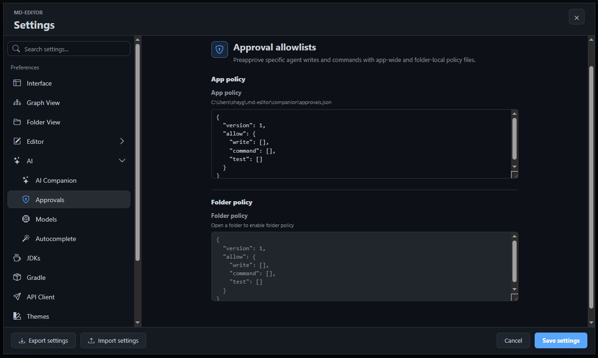

---
tags:
  - the_rest
---
# 8.3. Agent And Plan Mode

Agent mode and Plan mode are for work that needs more structure than a single answer. Plan mode researches and writes a reviewable plan without changing files. Agent mode can perform visible multi-step tasks, including approved edits, settings changes, Git panel actions, API Client updates, and command or test execution.

Open the panel, use the composer mode menu, then choose <kbd>Plan mode</kbd> or <kbd>Agent mode</kbd>.

## Use Plan Mode Before Risky Work

Plan mode is read-only. It can inspect the workspace, read active documents, search files, read open tabs, examine links, and prepare a structured plan. It should not edit files, run commands, run tests, or claim implementation has started.

Use Plan mode when:

- The work touches several files.
- You want a second opinion before changing behavior.
- You need architecture research before implementation.
- You want acceptance criteria and test coverage before coding.
- You are asking AI Companion to document, refactor, or debug a complex workflow.

Business benefit: Plan mode creates a pause between analysis and execution. You can review the intended work, correct assumptions, and keep the final implementation smaller.

## Saved Plans

The saved plans button in the AI Companion header opens the plan repository view. Plans can be filtered by status, searched, refreshed, opened as tabs, renamed, marked implemented, archived, deleted, or executed later from Agent mode.

Saved plans are useful when a task is too large for one sitting. They turn a conversation into a local Markdown artifact that can be reviewed, edited, and reused.

Typical plan lifecycle:

1. Ask Plan mode for a detailed implementation plan.
2. Review the plan in the panel or open it as a tab.
3. Rename it so the title is clear.
4. Execute it from Agent mode only when the plan is approved.
5. Mark it implemented or archive it when the work is done.

## Agent Mode Task Flow

Agent mode is the execution workflow. It can use read tools first, then request actions when work requires changes.

A normal Agent task looks like this:

1. You describe the task.
2. The assistant inspects relevant editor, folder, Git, graph, or API Client context.
3. The activity stream shows searches, reads, proposed edits, commands, or Git actions.
4. Approval cards appear when the requested action needs your confirmation.
5. The assistant reports the final result, changed files, attempted actions, and any remaining limitations.

> Tip: Give Agent mode a concrete finish line: "Update only the AI Companion user guide pages and run the help-doc link test." Clear boundaries produce safer work.

## Approvals And Authority

Approval settings decide what Agent mode can do automatically and what must stop for confirmation.

The app supports app-wide and folder-level approval policies. The app-wide policy lives in the local MD-Editor profile, and folder-level policy can live inside the opened folder under `.md-editor/companion/approvals.local.json`. This lets you keep strict defaults while allowing trusted commands or paths for a specific project.

Actions that may require approval include:

- File edits and file writes.
- Live editor changes, such as inserting text or replacing a selection.
- Shell commands and test commands.
- Git panel mutations, such as staging, committing, fetching, pulling, pushing, or switching branches.
- Settings updates.
- API Client mutations, such as creating requests, updating environments, or changing mocks.

Business benefit: approvals let you use Agent mode for real work without giving it silent control over your workspace.

## Activity Cards

Activity cards are not decoration. They are the audit trail for the run. They can show:

- Searches and file reads.
- Graph state, graph node searches, local graph views, and path searches.
- Git status, diffs, branch lists, and change digests.
- Editor actions and file comparisons.
- API Client searches, request sends, environment reads, mock calls, and redacted secrets.
- Approval decisions and auto-approved policy matches.
- Commands, tests, stdout, stderr, and errors.

If a task goes in the wrong direction, stop it and start a new prompt with narrower instructions.

## Agent Mode Examples

Good Agent prompts are specific:

- "Read the current AI Companion docs and add a troubleshooting section. Do not touch runtime code."
- "Create an API Client request for the selected OpenAPI endpoint and save it under the existing collection."
- "Use the Git panel to summarize unstaged changes, but do not stage or commit anything."
- "Update the active Markdown selection to be more concise, preserving the heading structure."
- "Inspect the graph tab and focus the nodes related to code conversion export."

## When To Avoid Agent Mode

Use Chat mode instead when you only need an answer. Use Plan mode instead when the work is still ambiguous. Avoid Agent mode for broad prompts like "clean this project" or "fix everything"; those prompts create too much room for unrelated changes.

Previous: [8.2. Chat And Context](02-chat-and-context.md)  
Next: [8.4. Autocomplete](04-autocomplete.md)
