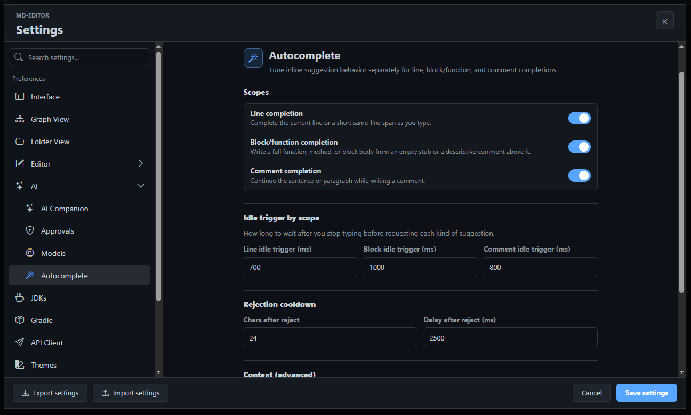

---
tags:
  - the_rest
---
# 8.4. Autocomplete

AI Companion Autocomplete shows inline ghost suggestions while you type in the editor. It is designed for small, immediate writing help: completing a sentence, continuing a Markdown section, filling an empty function body, or extending a comment in the style of nearby text.

Open <kbd>Actions</kbd> -> <kbd>Settings...</kbd> -> <kbd>AI</kbd> -> <kbd>Autocomplete</kbd>.

## What Autocomplete Helps With

Autocomplete is most useful when you are already writing and want to stay in flow:

- Continue a Markdown paragraph in the same voice.
- Fill a bullet list with the next expected item.
- Complete a code line without opening the AI panel.
- Generate a function body when the surrounding code makes the intent clear.
- Continue an explanatory comment.

Business benefit: autocomplete reduces small interruptions. You do not need to stop, open a chat, describe the file, wait for a full answer, and copy text back. The suggestion appears where your cursor already is.

## Suggestion Types

The autocomplete system can shape requests differently depending on the cursor context:

| Suggestion Type | What It Tries To Do |
| --- | --- |
| Line completion | Finish the current line or continue with the next small piece of text. |
| Block completion | Fill an empty function, method, Markdown section, or structured block. |
| Comment completion | Continue a comment or explanatory note without drifting into unrelated code. |

The app can use fill-in-the-middle style prompting for supported model families, or a chat-style prompt for instruct models. The <kbd>Model family</kbd> setting helps the app choose the right request format.

## Timing Controls

Autocomplete should feel helpful without fighting your typing. The timing settings control when suggestions appear and disappear:

- Idle delay controls how long the editor waits after typing before asking for a suggestion.
- Block idle delay can give larger completions more time.
- Comment idle delay tunes comment continuation separately.
- Reject characters hides a stale suggestion after you type enough new text.
- Reject delay hides a suggestion after it has waited too long.

> Tip: If suggestions appear too aggressively, increase the idle delays. If they feel late, reduce the delays after confirming your model responds quickly.

## Context Window

Prefix and suffix window settings control how many lines before and after the cursor are sent as context. More context can improve accuracy, especially in code, but it can also slow requests and consume more tokens.

Use these defaults as a starting point:

- Increase prefix lines when the model misses imports, definitions, or section context above the cursor.
- Increase suffix lines when the model repeats text that already exists after the cursor.
- Reduce both when a local model is slow.
- Enable open-file context providers when related open tabs should influence completions.

> Note: Autocomplete context is not the same as Chat history. It is built from the active editor location and the configured context providers.

## Accepting And Rejecting

The suggestion appears as ghost text in the editor. Continue typing to reject it naturally, or use the app's editor acceptance behavior when the suggestion is correct. If the suggestion is wrong repeatedly, change the prompt context by adding a clearer comment, heading, function name, or nearby example.

Good setup cues:

- A descriptive Markdown heading before a new section.
- A short comment before an empty code block.
- A function name that says what the function should return.
- Nearby examples with the style you want repeated.

## Common Problems

| Problem | What To Try |
| --- | --- |
| No suggestions appear | Confirm AI Companion and Autocomplete mode are enabled. Check provider settings and try Chat mode first. |
| Suggestions are slow | Increase idle delay, reduce context lines, or use a faster model. |
| Suggestions repeat existing text | Increase suffix lines or use a model family with better fill-in-the-middle support. |
| Suggestions are too broad | Add a heading, comment, or partially written sentence that narrows the intent. |
| Suggestions are not code-like | Set the model family explicitly if auto-detection chooses the wrong prompt style. |

Previous: [8.3. Agent And Plan Mode](03-agent-and-plan-mode.md)  
Next: [8.5. Git Summary And Integrations](05-git-summary-and-integrations.md)
