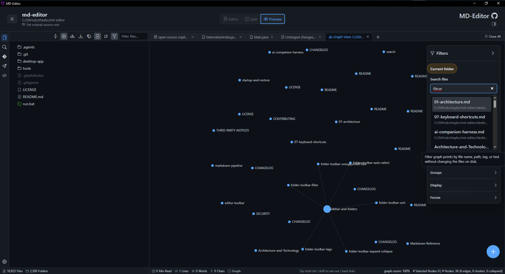
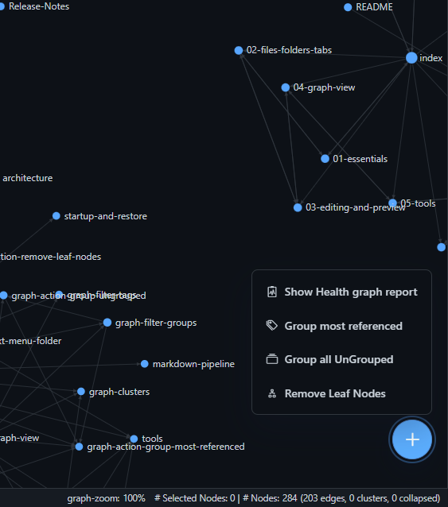
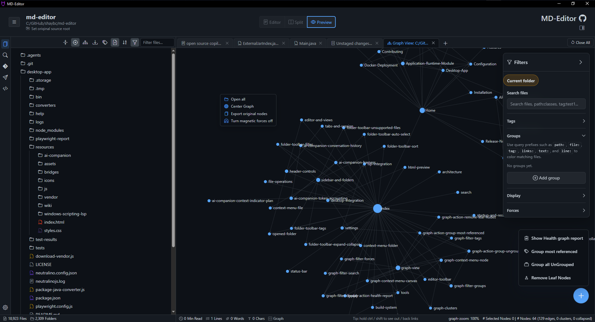

# Detailed Graph View Controls

Graph View turns Markdown files, wiki links, tags, generated dependency metadata, external dependencies, and missing dependency references into an interactive map.

## Canvas Controls

| Control | Use |
| --- | --- |
| Drag canvas | Pan the graph. |
| Mouse wheel or trackpad | Zoom in and out. |
| Click node | Select a node and inspect connected context. |
| Double-click node | Open the represented file when available. |
| Right-click node | Open the node context menu. |
| Right-click canvas | Open the canvas context menu. |
| <kbd>Ctrl</kbd>+<kbd>F</kbd> | Find nodes in the graph. |

The status bar shows graph zoom, selected-node count, visible node count, visible edge count, cluster count, and collapsed-node count while a graph tab is active.

## Filters Panel

The filters panel controls what is visible without changing source files.

| Section | What It Controls |
| --- | --- |
| Search files | File, path, tag, text, line, and link-count queries. |
| Tags | Show tag nodes and filter to files connected to a selected tag. |
| Groups | Named node sets with colors, visibility, and query-based membership. |
| Display | Labels, arrows, orphan nodes, external dependencies, missing dependencies, text fade, node size, and link thickness. |
| Forces | Center force, repel force, link force, link distance, and group force. |

Search prefixes include `path:`, `file:`, `tag:`, `links:`, `text:`, and `line:`. Text and line queries require file content to be available; lightweight saved graphs may not include it.

## Quick Actions

The quick actions menu supports:

- Show health graph report.
- Group most referenced files.
- Group all ungrouped files.
- Remove leaf nodes from the current view.

## Context Menus

Node actions can open files, reveal files, open original source files for generated Markdown, copy paths, manage tags, focus local graph views, collapse or expand nodes, and export related source when metadata is available.

Canvas actions focus the whole graph rather than one node. Use them for opening visible nodes, centering, export workflows, and force behavior.

## Health And Recovery

Graph health reports can reveal broken links, missing dependency nodes, unresolved Java packages, orphaned files, and source-root problems. For the Java recovery workflow, see [Maven Dependency Recovery And Update Project](maven-dependency-recovery.md).

## Implementation Notes

Current desktop modules:

| Area | File |
| --- | --- |
| Snapshot extraction | `desktop-app/resources/js/graph/extraction.js` |
| Rendering and D3 interaction | `desktop-app/resources/js/graph/renderer.js` |
| Filters and groups | `desktop-app/resources/js/graph/toolbar.js` |
| Graph documents and tabs | `desktop-app/resources/js/graph/documents.js` |
| Persistence | `desktop-app/resources/js/graph/persistence.js` |
| Health reports | `desktop-app/resources/js/graph/health.js` |
| Maven recovery | `desktop-app/resources/js/graph/maven-recovery.js` |

Previous: [4. Graph View](04-graph-view.md)  
Next: [Maven Dependency Recovery And Update Project](maven-dependency-recovery.md)
