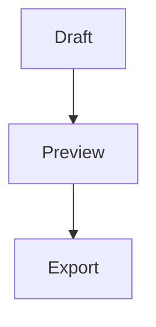

# Markdown Reference

This page summarizes the Markdown syntax MD-Editor is built around. Use it as a quick reference while writing, previewing, and exporting technical notes.

## Headings

```markdown
# Heading 1
## Heading 2
### Heading 3
```

Headings create document structure, preview anchors, and navigable sections.

## Emphasis

```markdown
**bold**
*italic*
~~strikethrough~~
`inline code`
```

Use inline code for commands, filenames, API names, setting keys, and literal values.

## Lists

```markdown
- Bullet item
- Another item

1. First step
2. Second step

- [ ] Open item
- [x] Done item
```

Task lists render as checkboxes in preview.

## Links

```markdown
[Link text](https://example.com)
[Local doc](../user/03-editing-and-preview.md)
<https://example.com>
[[Wiki Link]]
```

Standard Markdown links are best for explicit URLs and file paths. Wiki links are useful for note-style relationships and Graph View.

## Images

```markdown

```

Use descriptive alt text when the image carries meaning. Local image paths should be relative to the document when possible.

## Tables

```markdown
| Field | Meaning |
| --- | --- |
| Status | Current state |
| Owner | Responsible person |
```

Tables are useful for options, settings, API fields, and comparison notes.

## Code Blocks

````markdown
```javascript
console.log("Hello");
```
````

Add a language name after the opening fence for syntax highlighting.

## Blockquotes And Alerts

```markdown
> Normal quote

> [!NOTE]
> Important supporting detail.

> [!WARNING]
> Risk or operational warning.
```

GitHub-style alerts support `NOTE`, `TIP`, `IMPORTANT`, `WARNING`, and `CAUTION`.

## Frontmatter

```yaml
---
tags:
  - api
  - backend
title: Service Notes
---
```

Frontmatter can feed preview metadata, tag workflows, and Graph View.

## Mermaid

````markdown

````

Mermaid diagrams render in preview and can be exported from the diagram toolbar.

## Math

```markdown
Inline math: $x + y$

Block math:
$$
E = mc^2
$$
```

Use MathJax syntax for formulas and technical notes.

## Toolbar Help

Most syntax above can be inserted from the formatting toolbar. For the detailed toolbar and modal reference, see [Editor Toolbar And Modal Actions](editor-toolbar-and-modals.md).

Previous: [3. Editing And Preview](03-editing-and-preview.md)  
Next: [Search Workflow Details](search-workflows.md)
